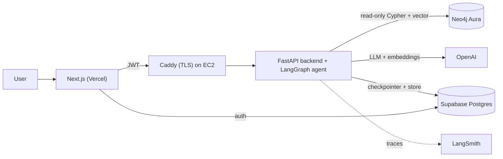

# Phase 10 — Documentation & Polish (C4 + Setup Guides + README)

## Objective

Produce portfolio-grade documentation:
- **C4-structured `docs/`**: System Context → Container → Component → Code, plus a Deployment diagram and happy/error-path sequence diagrams (Mermaid).
- **`docs/setup/` guides**: `docker.md`, `langgraph-studio.md`, `neo4j.md`, `aws.md`.
- **Top-level `README.md`** with diagrams, a demo GIF, and LangGraph Studio + LangSmith screenshots.
- Final docstring/type sweep so nothing is undocumented.

## Prerequisites

- Phases 1–9 complete; the app runs locally and (ideally) in prod.

## Steps

### 1. C4 architecture docs — `docs/`

Create these Mermaid-based pages (each with a short prose intro):

- `docs/01-context.md` — **System Context**: User ↔ Reel system ↔ external systems (OpenAI, Neo4j Aura, Supabase, LangSmith).
- `docs/02-container.md` — **Containers**: Next.js (Vercel), FastAPI backend (EC2), LangGraph agent (in-process), Caddy, Neo4j Aura, Supabase Postgres.
- `docs/03-component.md` — **Components** inside the backend + agent: routes, deps, auth, graph, nodes, tools, memory.
- `docs/04-code.md` — **Code**: the agent state machine (router → tools → generate), the read-only Cypher guard, the SSE stream.
- `docs/05-deployment.md` — **Deployment** diagram: GitHub Actions → GHCR → EC2 (Caddy + backend) + Vercel + Aura + Supabase.
- `docs/06-sequences.md` — **Sequence diagrams**: happy path (question → route → retrieve → generate → stream) and error path (unsafe Cypher rejected / empty context → fail-closed).

Example container diagram to adapt:



Reuse the diagrams already in the plan (`.cursor/plans/graphrag_movie_agent_e5678c2b.plan.md`) as a starting point.

### 2. Setup guides — `docs/setup/`

- `docs/setup/docker.md` — prerequisites; `docker compose build`; `docker compose up`; the services (neo4j, backend, frontend, agent); required `.env` vars; common errors (port conflicts, healthcheck failures, `NEO4J_URI` host inside compose).
- `docs/setup/langgraph-studio.md` — install `langgraph-cli[inmem]`; `cd apps/agents && uv run langgraph dev`; open Studio; select the `agent` graph; inspect state, replay, and time-travel via the checkpointer.
- `docs/setup/neo4j.md` — local Docker Neo4j; Aura Free signup; loading data (`ingestion.load_graph`) and building the index (`ingestion.build_index`); creating a **read-only** role/user where the edition supports RBAC; verifying the vector index (`SHOW VECTOR INDEXES`).
- `docs/setup/aws.md` — EC2 free-tier launch; Elastic IP; security group; swap file; installing Docker; copying `docker-compose.prod.yml` + `Caddyfile` + prod `.env`; DNS; running `deploy.sh`; renewing certs (automatic via Caddy).

Each guide is step-by-step and copy-pasteable, matching the exact commands used in earlier phases.

### 3. Top-level `README.md`

Replace the skeleton with:
- One-paragraph pitch + the container Mermaid diagram.
- **Quickstart** (local): clone, fill `.env`, `docker compose up`, open `localhost:3000`.
- **Architecture**: link to `docs/` C4 pages.
- **Tech stack** badges (LangGraph, Neo4j, FastAPI, Next.js, Supabase, AWS, Vercel).
- **Screenshots**: LangGraph Studio graph, a LangSmith trace, the chat UI.
- **Demo GIF** of a movie question streaming an answer with sources.
- Links to the live Vercel URL and the backend `/health`.

### 4. Final docstring + type sweep

Run the full gate and fix everything:

```powershell
uv run ruff check .            # incl. D docstring rules
uv run ruff format --check .
uv run pyright
uv run pytest -q
pnpm --dir apps/frontend lint
pnpm --dir apps/frontend tsc --noEmit
```

Confirm every module/class/function/method has a docstring, every Pydantic/settings field has `Field(description=...)`, and every LangGraph node has its contract docstring.

## Acceptance criteria

- [ ] `docs/` contains the 6 C4/sequence pages with rendering Mermaid diagrams.
- [ ] `docs/setup/` has `docker.md`, `langgraph-studio.md`, `neo4j.md`, `aws.md`, each step-by-step and accurate.
- [ ] `README.md` has diagrams, quickstart, screenshots, and a demo GIF.
- [ ] The full gate (ruff + ruff format + pyright + pytest + frontend lint/typecheck) is green.
- [ ] No undocumented public functions remain (ruff `D` passes with no ignores added).

## Do NOT

- Do NOT let diagrams drift from the real system — reflect what was actually built.
- Do NOT paper over `D` failures with `# noqa` — write the docstring.
- Do NOT include secrets or real tokens in screenshots or docs.

## Relevant rules & skills

- Rules: `documentation`.
- Skill: `verify-standards` (final green gate before calling the project done).
