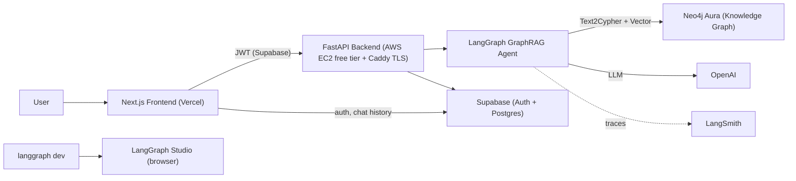
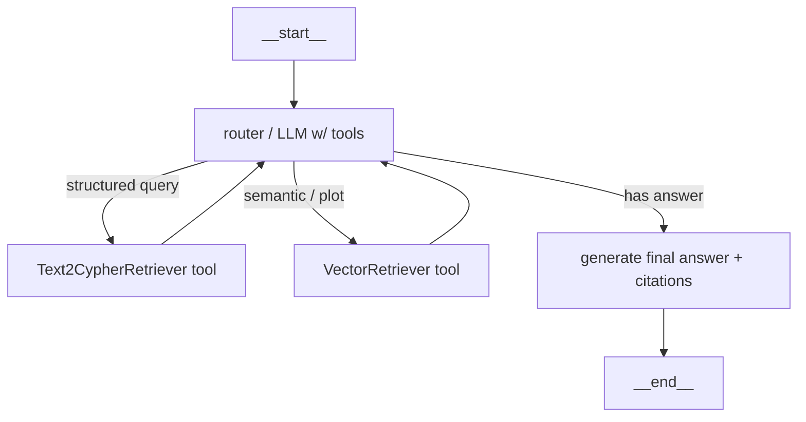

# GraphRAG Movie Agent — Portfolio Project Plan

A full-stack AI agent that answers natural-language questions about movies (actors, directors, genres, recommendations) by reasoning over a **Neo4j knowledge graph** with a **LangGraph** agent. Designed to look and behave like a real production system.

## Architecture



- **Domain:** Movies. Uses the canonical Neo4j movie graph schema (`(:Person)-[:ACTED_IN|DIRECTED]->(:Movie)`, `(:Movie)-[:IN_GENRE]->(:Genre)`), enriched with plot embeddings for hybrid retrieval.
- **Monorepo**, Dockerized, single `docker-compose.yml` spins up the whole stack locally.

## Repo structure

Three apps under `apps/` — `apps/agents` (the LangGraph deployable), `apps/backend` (the FastAPI HTTP layer), and `apps/frontend` (Next.js) — tied together by a **uv workspace** root. This mirrors the `apps/agents` + `apps/backend` decoupling from the prior project's `MONOREPO_RESTRUCTURE_PLAN.md`: the LangGraph agent can be run/deployed independently (`langgraph dev` / `langgraph build`), while the backend depends on the `agents` package and imports the compiled graph. Both apps stay clean of the "god file + in-handler imports" anti-pattern the QA reviews flagged (thin routes, service layer, DI, one settings object, tests from the start).

```text
/
├── pyproject.toml              # uv workspace root (members = ["apps/agents", "apps/backend"])
├── uv.lock                     # single committed lockfile
├── docker-compose.yml          # neo4j + backend + frontend for local dev
├── .env.example                # every var documented inline; no placeholder secrets that boot
├── README.md                   # C4 diagrams, demo GIF, run instructions
├── .pre-commit-config.yaml     # ruff, ruff-format, end-of-file-fixer
├── .github/workflows/ci.yml    # lint + typecheck + tests + docker build
├── docs/                       # C4 architecture (Context -> Container -> Component -> Code) + Deployment
│   └── setup/                  # step-by-step setup guides:
│       ├── docker.md           #   local stack via docker-compose (build/up, env, troubleshooting)
│       ├── langgraph-studio.md #   run `langgraph dev`, open Studio, inspect/replay the graph
│       ├── neo4j.md            #   Aura Free signup + local Neo4j; load data; read-only role; vector index
│       └── aws.md              #   EC2 free-tier: launch, swap, Docker+Caddy, DNS/Elastic IP, deploy
│
├── apps/
│   ├── agents/                 # LangGraph deployable (the AI agent)
│   │   ├── pyproject.toml       # name = "agents"; Python 3.11+
│   │   ├── langgraph.json       # for `langgraph dev` / Studio -> src/agents/graph.py:graph
│   │   ├── Dockerfile           # placeholder for future `langgraph build` image
│   │   ├── src/
│   │   │   ├── agents/
│   │   │   │   ├── graph.py      # compiled LangGraph graph (Studio entrypoint)
│   │   │   │   ├── state.py      # AgentState TypedDict + documented reducers
│   │   │   │   ├── nodes.py      # router, retrieve, generate (RetryPolicy per node)
│   │   │   │   ├── tools.py      # Text2Cypher (READ-ONLY) + Vector retriever tools
│   │   │   │   ├── clients.py    # lru_cache'd LLM + pooled Neo4j driver factories
│   │   │   │   ├── prompts/      # versioned prompt files (not inline strings)
│   │   │   │   └── settings.py   # agent pydantic-settings (Field(description=))
│   │   │   └── ingestion/
│   │   │       ├── load_graph.py # load Neo4j sample movies dataset, create constraints
│   │   │       └── build_index.py# plot/tagline embeddings + Neo4j vector index
│   │   ├── tests/               # pytest: Cypher-safety validator, prompt builders, graph fixtures
│   │   └── data/movies.cypher   # bundled Neo4j sample-movies seed (Cypher)
│   │
│   ├── backend/                # FastAPI HTTP layer (depends on `agents`)
│   │   ├── pyproject.toml        # name = "backend"; deps = ["agents", "fastapi", ...]
│   │   ├── Dockerfile            # non-root user, HEALTHCHECK, pinned base digest
│   │   ├── src/
│   │   │   └── api/
│   │   │       ├── main.py       # app factory + lifespan (eager graph build, pool init)
│   │   │       ├── middleware.py # security headers, request-ID, structured logging
│   │   │       ├── deps.py       # Depends() providers (settings, graph, current user)
│   │   │       ├── auth.py       # Supabase JWT (JWKS/RS256) verify dependency
│   │   │       ├── schemas.py    # Pydantic request/response models (response_model=)
│   │   │       ├── settings.py   # backend pydantic-settings
│   │   │       └── routes/
│   │   │           ├── chat.py   # POST /chat (SSE stream), rate-limited
│   │   │           └── health.py # /health (liveness) + /ready (deps check)
│   │   └── tests/               # pytest: route contract tests (app.dependency_overrides)
│   │
│   └── frontend/               # Next.js (App Router) — ports the delivered Stitch UI
│       ├── Dockerfile            # non-root, multi-stage
│       ├── tailwind.config.ts    # tokens ported from Stitch DESIGN.md (noir + gold, Playfair/Inter)
│       ├── app/
│       │   ├── page.tsx          # landing (from reel_cinematic_ai_movie_assistant)
│       │   ├── (auth)/login/     # sign-in/sign-up (from sign_in_to_reel)
│       │   └── chat/             # three-pane chat app (from reel_movie_intelligence_chat)
│       ├── components/           # Sidebar, ChatThread, MessageBubble, CitationChip,
│       │                         #   SourcesPanel, GraphPanel, ChatInput, SuggestionChips
│       ├── lib/supabaseClient.ts # Supabase auth
│       └── lib/api.ts            # SSE streaming client to backend /chat
│
└── infra/
    └── aws/                    # EC2 free-tier setup: user-data/cloud-init, Caddyfile, deploy script
```

## Agent design (LangGraph GraphRAG)

Graph with tool-calling routing so the LLM chooses retrieval strategy:



- **`Text2CypherRetriever`** (from `neo4j-graphrag`) with the movie schema + few-shot NL→Cypher examples for structured questions ("movies Tom Hanks directed").
- **`VectorRetriever` / `HybridCypherRetriever`** over plot embeddings for fuzzy/semantic questions ("a heist movie set in space").
- Both wrapped via `.convert_to_tool(...)` and bound to the router LLM; LangGraph handles the tool loop.
- `PostgresSaver` (Supabase Postgres) as checkpointer for conversation memory (thread_id per chat).

## Key technical decisions (verified against 2026 docs)

- **LangGraph Studio:** `pip install "langgraph-cli[inmem]"`, run `langgraph dev` from `apps/agents/` (browser-based, no desktop app). `apps/agents/langgraph.json` points `graphs.agent` at `src/agents/graph.py:graph`.
- **Workspace:** `uv` workspace root with members `apps/agents` and `apps/backend`; single committed `uv.lock`. `backend` declares `agents` as a workspace dependency and imports the compiled graph directly (can later flip to `langgraph_sdk` HTTP calls if the agent is deployed separately).
- **Serving/streaming:** FastAPI endpoint uses `graph.astream_events(..., version="v3")` mapped to an SSE `text/event-stream` response for token streaming. (LangGraph Platform/Server noted as an alternative, but hand-rolled FastAPI keeps the "deploy to AWS" story clean.)
- **LangSmith:** env vars are `LANGSMITH_TRACING=true` + `LANGSMITH_API_KEY` (not legacy `LANGCHAIN_*`).
- **Supabase auth in FastAPI:** verify Bearer JWT locally against the project JWKS endpoint (`/auth/v1/.well-known/jwks.json`, RS256, aud=`authenticated`). Requires asymmetric signing keys enabled on the Supabase project.
- **Neo4j:** Neo4j Aura (managed) for cloud; `neo4j` service in `docker-compose` for local.

## Production standards baked in from day one (lessons from prior QA reviews)

The reviews in `REVIEW.md`, `14_QA_SECURITY_REVIEW.md`, `15_QA_CODE_QUALITY_REVIEW.md`, and `16_QA_DOCUMENTATION_REVIEW.md` catalogue exactly what separates a toy demo from a real system. Those findings become requirements here, not future cleanup.

### Security (from 14 / REVIEW §3)
- **Auth on every route.** `/chat` requires a valid Supabase JWT via a router-level `Depends`. No unauthenticated data/LLM endpoints (fixes the class of S2/B-C1).
- **GraphRAG-specific — read-only Cypher (new, critical here).** `Text2CypherRetriever` lets an LLM generate Cypher from user text. Run it against a **read-only Neo4j user/role** and inside `session.execute_read(...)`, reject any query containing write clauses (`CREATE|MERGE|DELETE|SET|REMOVE|DROP|CALL {…} … apoc.*` write procs) via an allowlist. This is the GraphRAG equivalent of the Airtable formula-injection finding (A-C3).
- **CORS:** explicit origin allowlist, no `*`+credentials, fail-fast if `CORS_ALLOW_ORIGINS` unset in prod (B-H1).
- **Generic error bodies:** global handler logs full trace server-side with a `request_id`, returns `{"detail":"Internal server error"}` — never `str(exc)` (B-C4/M2).
- **Bounded inputs:** `limit`/`offset` and any list params use `Query(ge=, le=)`; request-body size capped at the ASGI layer (B-C3/B-C2).
- **Constant-time secret comparison** (`hmac.compare_digest`) everywhere a secret is checked (H6/B-H3).
- **Rate limiting** on `/chat` via `slowapi` (per-IP + per-user) — LLM cost-abuse guard (B-H6).
- **LLM safety:** explicit `timeout=` and `max_tokens` on every model call; model set in settings (A-C2/A-H3).
- **Startup validation:** refuse to boot if required env vars missing or still placeholders (L1/B-M8).
- **Security headers** middleware (`X-Content-Type-Options`, `X-Frame-Options`, HSTS, `Cache-Control: no-store`) (B-M6).
- **No secrets/PII in logs;** sanitize any user-derived strings before logging (B-M5/A-H7).
- **Docker:** non-root user, `HEALTHCHECK`, pinned base image digest (M3/B-M7).

### Code quality & architecture (from 15 / REVIEW §4)
- **Thin routes + service layer + DI.** Routes call injected services via `Depends`; no business logic or lazy imports inside handlers (Q2/Q3/Q10).
- **One `Settings(BaseSettings)` object** with `Field(description=...)`; no scattered `os.getenv` (Q8/B-T4).
- **Cached, pooled clients.** `lru_cache` factories for the LLM and a **pooled** Neo4j driver + `AsyncConnectionPool` for the Postgres checkpointer — never construct per request/call (A-O1/A-D4).
- **Async correctness:** `await asyncio.sleep`, `asyncio.Lock` (never `threading.Lock` across `await`), `asyncio.gather` + `Semaphore` for any fan-out (B-H7/B-H8/B-O1).
- **Typed everything:** `response_model=` on every route; per-node `TypedDict` state updates; standardize on `X | None` (ruff `UP007`) (B-Q2/A-Q7).
- **Retries via `tenacity`** with exponential backoff + jitter, honoring `Retry-After` — one shared policy, plus LangGraph `RetryPolicy` on nodes (A-H4/A4).
- **Fail closed:** on retrieval/generation errors, return a clear error state — never emit a confident answer from empty/partial context (A6).
- **Real health checks:** `/health` liveness + `/ready` that verifies Neo4j + checkpointer connectivity; build the graph eagerly in `lifespan` (B-O7/B-D4).

### AI agent design (from REVIEW §5)
- **Checkpointer from day one:** `PostgresSaver`/`AsyncPostgresSaver` (Supabase Postgres), `thread_id` per conversation → memory, resumability, time-travel in Studio (A1).
- **`PostgresStore` (BaseStore)** for cross-conversation memory: remember user preferences (e.g. "prefer recent films", favorite genres) and improve answers over time — the thing that makes it an *agent*, not a stateless Q&A box (A2).
- **LangSmith fully wired:** every run tagged with `run_name`, `tags`, and `metadata` (user_id, retrieval strategy) so traces are filterable — not just `TRACING=true` (A7).
- **Versioned prompts** in files with a version field (or LangSmith Prompt Hub), never inline strings (A9).

### Observability, testing, docs (from 15 / 16)
- **Structured JSON logging + `X-Request-ID`** middleware; optional Prometheus metrics via `prometheus-fastapi-instrumentator` (B-T2/B-T3).
- **Tests from the start:** `pytest` + `pytest-asyncio`; unit tests for pure functions (Cypher-safety validator, prompt builders) and route contract tests using `app.dependency_overrides` to stub the graph (A-T1/B-T1).
- **Docstrings on every function/method — enforced.** Not just LangGraph nodes: every module, class, function, and method carries a docstring, gated in CI via ruff's pydocstyle rules (`select = ["D"]`, Google convention) so undocumented code fails the build (addresses the ~30% coverage gap in `16_QA` D14). LangGraph nodes additionally follow a contract docstring documenting *reads / writes / side effects / failure mode*. `Field(description=...)` on all Pydantic + settings fields (D15/D16).
- **C4 documentation:** `docs/` organized as System Context → Container → Component → Code, plus a Deployment diagram and happy/error-path sequence diagrams — the structure `16_QA` recommends, done right the first time (D1/D4/D27/D30).
- **Tooling:** `ruff` (incl. pydocstyle `D` rules for mandatory docstrings) + `ruff format`, `pre-commit`, `pyright`, `uv.lock` committed, GitHub Actions CI gate (REVIEW §7).

## Cursor rules & skills (dev-experience tooling)

Tracked in a **separate plan** — see `Cursor Rules and Skills` (`.cursor/plans/cursor_rules_and_skills_*.plan.md`). It defines 7 rules (`.cursor/rules/*.mdc`) and 3 skills (`.cursor/skills/*/SKILL.md`) that encode this project's structure, docstring, and standards decisions. **Execute that plan first**, before scaffolding, so every later implementation step auto-follows the standards.

## Deployment

- **Frontend → Vercel:** connect repo, root = `frontend/`, env vars for Supabase + backend URL.
- **Backend + agent → AWS EC2 (free tier):** single `t2.micro`/`t3.micro` (1 vCPU, 1 GB RAM, 750 hrs/mo free for 12 months). Runs Docker + the backend container + **Caddy** as a reverse proxy terminating HTTPS with automatic Let's Encrypt certs (no paid ALB). Deploy by pulling the image built in CI (GHCR/ECR) via a small deploy script; `docker compose` for backend + Caddy on the box.
  - **RAM budget (the one real constraint):** keep Neo4j **off** the instance (Aura Free) and Supabase managed; use OpenAI API for embeddings (no local ML deps); run **1 uvicorn worker**; add a **1–2 GB swap file** as a safety net. Note: `BATCH_STORAGE`-style in-process state is avoided anyway (checkpointer-backed), so single-worker is fine.
- **Neo4j:** Aura Free tier (managed). **Supabase:** managed (auth + Postgres checkpointer/store).
- **CI:** GitHub Actions — lint + typecheck + tests, build backend image, push to registry, then SSH deploy to EC2 (or `docker compose pull && up -d`). Trigger Vercel deploy for the frontend.

## Suggested build order (phases)

0. **(Separate plan)** Create the Cursor rules + skills first — see the `Cursor Rules and Skills` plan.
1. Scaffold uv-workspace monorepo (`apps/agents`, `apps/backend`, `apps/frontend`) + Docker + tooling (compose with Neo4j; ruff/pre-commit/pyright; per-app `Settings` models; committed uv.lock).
2. Data ingestion: load the **Neo4j sample movies dataset** into Neo4j (constraints + Person/Movie/Genre relationships) + build the plot embeddings vector index; create a dedicated **read-only** Neo4j role for the agent.
3. LangGraph agent (tools, nodes with `RetryPolicy`, read-only Cypher guard, compiled graph) + `PostgresSaver` checkpointer + `PostgresStore` + `langgraph.json` for Studio.
4. FastAPI backend: thin routes + service layer + DI, `/chat` SSE streaming, Supabase JWT auth, rate limiting, security headers, structured logging, LangSmith tags/metadata, `/health` + `/ready`.
5. Tests: unit (Cypher-safety, prompt builders) + route contract tests with `dependency_overrides`.
6. Next.js frontend: port the delivered Stitch export (`stitch_reel_ai_movie_assistant/`) — move its `tailwind.config` tokens into the app, fonts via `next/font`, convert the 3 screens (landing, sign-in, three-pane chat) to React components, then wire Supabase auth + SSE streaming + Sources/Graph panels to live data.
7. Deploy: Vercel (frontend), AWS EC2 free-tier + Caddy TLS (backend, single container + swap), Aura + Supabase cloud; CI gate.
8. Docs & polish: C4 `docs/` (Context/Container/Component/Code + Deployment) + `docs/setup/` guides (Docker, LangGraph Studio, Neo4j, AWS EC2), README with diagrams + demo GIF + Studio/LangSmith screenshots.

## Open items to confirm during build

- LLM provider: **OpenAI (confirmed)** — chat model (`gpt-*`) for router/generation/Text2Cypher, `text-embedding-3-large` for plot embeddings. Keys via env.
- Data source is decided: the **Neo4j built-in sample movies dataset**, loaded once via the ingestion script (no user upload feature). Ingestion also generates plot/tagline embeddings into a Neo4j vector index for semantic retrieval.
- **Stitch UI delivered** in `stitch_reel_ai_movie_assistant/` (design system `DESIGN.md` + 3 screens as HTML/Tailwind: landing, sign-in, three-pane chat). It will be ported into `apps/frontend` during the frontend phase. The right-panel **Graph** tab needs a graph-viz lib in React (e.g. `react-force-graph` / `cytoscape`) since Stitch only mocks the visual — confirm library choice at build time.
- **Domain for backend HTTPS:** Caddy's auto-TLS needs a hostname → EC2 IP. Pick one: a cheap custom domain (~$10/yr, best portfolio look), a free DuckDNS subdomain, or a free `sslip.io`/`nip.io` IP hostname. Also allocate an **Elastic IP** so the address survives instance restarts (free while attached to a running instance).
- **EC2 region/AMI:** default to Amazon Linux 2023 or Ubuntu LTS `t3.micro` in a region where the free tier applies; confirm the region.
