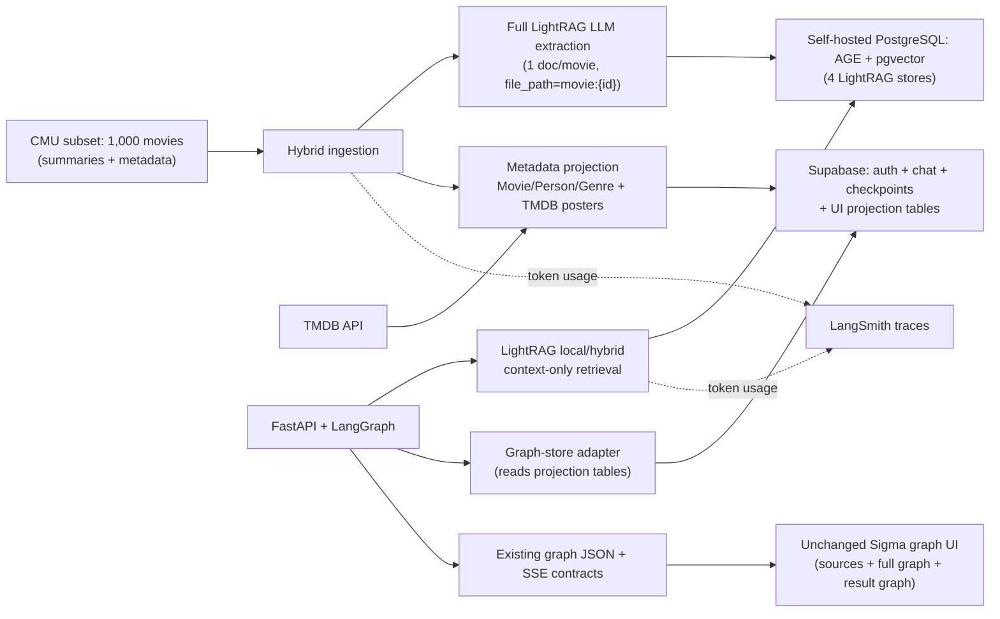

# Migrate Reel from Neo4j to LightRAG (1,000-movie CMU subset, hybrid load)

> **Execution status (2026-07-15):** the smoke ingest passed. The 1,000-movie
> run stopped at the OpenAI API limit with 506 processed documents; the largest
> fully processed deterministic prefix was finalized and validated at 503
> movies. Code supports resuming to 1,000 when quota is available.

## Decisions locked in

- **Engine:** LightRAG replaces Neo4j for storage + retrieval.
- **Data:** CMU MovieSummaries, a **deterministic 1,000-movie subset**.
- **Ingestion mode:** **Full LightRAG LLM extraction** over plot summaries (≈ $2–3 one-time on gpt-4o-mini + embeddings; wall-clock is **hours** — plan around it).
- **UI:** unchanged. Achieved with a **hybrid load** (see below).
- **Posters:** fetched from the **TMDB API** by title + year for the subset.
- **Tracing:** **LangSmith** traces token usage for both ingestion and every query.
- **Verified library facts (LightRAG v1.4.x):** storage classes `PGKVStorage` / `PGVectorStorage` / `PGGraphStorage` / `PGDocStatusStorage`; connection via `POSTGRES_HOST/PORT/USER/PASSWORD/DATABASE` + `POSTGRES_WORKSPACE`; `await rag.initialize_storages()` then `await initialize_pipeline_status()`; `ainsert(texts, ids=[...], file_paths=[...])`; `aquery(q, param=QueryParam(mode=..., only_need_context=True))`; custom embedding via `wrap_embedding_func_with_attrs(embedding_dim, max_token_size)`; the default LightRAG Postgres image bundles AGE + pgvector.

## Target architecture



**Two databases, clear split:**

- **Self-hosted PostgreSQL 16.6+ with Apache AGE + pgvector** — holds only LightRAG's four internal stores: the LLM-extracted knowledge graph, vectors, chunk/LLM cache, and doc status. Must be **self-hosted** (Docker container / VM), because managed Postgres — including Supabase — does not offer the Apache AGE extension.
- **Supabase (`Reel` project)** — unchanged for auth, conversations, messages, checkpoints, and store data, and now **also holds the UI projection tables** (`movies`, `people`, `genres`, `acted_in`, `in_genre`) that the frontend graph reads.

So there are two "graphs": LightRAG's internal extraction graph lives in the AGE Postgres (engine-internal, never read directly by the UI), while the typed Movie/Person/Genre graph the Sigma UI draws lives in Supabase projection tables.

## CMU data reference (exact formats — parse against these)

All files are tab-separated; `datasets/MovieSummaries/`.

- **`plot_summaries.txt`** — `wikipedia_id \t summary` (one line per movie; summary is free text, may be very long).
- **`movie.metadata.tsv`** — 9 columns: `1 wikipedia_id`, `2 freebase_movie_id`, `3 name`, `4 release_date` (`YYYY` or `YYYY-MM-DD` or empty), `5 box_office_revenue` (**often empty**), `6 runtime`, `7 languages` (JSON `{"/m/..":"English Language"}`), `8 countries` (JSON), `9 genres` (JSON `{"/m/..":"Thriller", ...}`).
- **`character.metadata.tsv`** — 13 columns: `1 wikipedia_id`, `2 freebase_movie_id`, `3 release_date`, `4 character_name`, `5 actor_dob`, `6 actor_gender`, `7 actor_height`, `8 actor_ethnicity`, `9 actor_name`, `10 actor_age_at_release`, `11 freebase_char_actor_map_id`, `12 freebase_char_id`, `13 freebase_actor_id` (e.g. `/m/0346l4`; may be empty).

Parsing rules:

- `year` = first 4 chars of `release_date` when present, else null.
- `box_office` = int(col5) when non-empty, else null. Subset ranking uses only movies with a non-null box office (these are the recognizable, poster-rich titles TMDB will resolve).
- `genres` = the **values** of the col9 JSON dict; `genre_id` = `genre:{percent-quoted casefold(name)}` (matches `_named_node_id`).
- `person_id` = `person:{percent-quoted col13}` (Freebase actor IDs contain `/`; quote with `urllib.parse.quote(..., safe='')`). Skip character rows with an empty `freebase_actor_id`.
- `character`, `billing_order` for `acted_in`: character = col4 (nullable); billing_order = row order within the movie (character.metadata has no explicit order — use file order).

## Why hybrid (the key design point)

Full LightRAG extraction yields free-form entities (characters, places, themes) that do not match the current typed `Movie`/`Person`/`Genre` graph, and CMU has no posters. To keep the UI identical, the same 1,000 movies are loaded **two ways** (two separate databases, so this is **not** one atomic transaction — correctness comes from idempotent, resumable writes and a post-load referential-integrity check, not cross-DB atomicity):

1. **Retrieval side** — plot summaries go through LightRAG's full LLM extraction so `local`/`hybrid` search is high quality. Each movie is inserted as **its own document** keyed by `movie:{wikipedia_id}` (see below).
2. **UI side** — a deterministic `Movie`/`Person`/`Genre` graph is built directly from the metadata, enriched with a TMDB `poster_url`, and written to **Supabase projection tables**. This powers the sources panel, the full graph, and the result graph unchanged.

### Mapping retrieval back to movies (the critical bridge)

A single per-document text marker is **not** reliable: LightRAG chunks documents (~1,200 tokens), so long CMU summaries produce later chunks with no marker, and `local`-mode context is dominated by entity/relation sections that carry no chunk text. If a hit lands on an unmarked chunk or an entity-only answer we recover zero movie IDs → empty sources/result graph, and fail-closed can wrongly refuse despite good context. Required mitigation:

- **Insert one document per movie** via `ainsert([text], ids=[f"movie:{wikipedia_id}"], file_paths=[f"movie:{wikipedia_id}"])`. LightRAG stores `file_path` on chunks (and associates it with extracted entities/relations) and echoes it into retrieved context, giving a chunk- and mode-independent key.
- **Recover keys by regex** `r"movie:(\d+)"` over the **entire** returned context blob (works whether the token appears in a chunk's file-path reference, an entity source, or a relation source).
- **Entity → movie fallback:** if the regex yields nothing (rare entity-only answers), match projection movie titles found in the context text (case-insensitive) → `movie:{wikipedia_id}`.
- Only when **both** recovery paths yield nothing is the turn treated as no-context (then fail closed).

## Implementation

### configure-lightrag

**Files:** `apps/agents/src/agents/settings.py`, `apps/agents/src/agents/clients.py`, `apps/agents/pyproject.toml`, new `apps/agents/src/agents/lightrag_service.py`.

1. **`pyproject.toml`:** remove `neo4j`, `neo4j-graphrag`; add `lightrag-hku` (the `lightrag` package), `asyncpg`, `httpx`, and `langsmith` (keep `langchain-openai`, `tenacity`, `tiktoken`, `openai`).
2. **`settings.py`** — new `AgentSettings` fields (all with `Field(description=...)`); remove `neo4j_*`, `vector_index_name`, `fulltext_index_name`. `extra="ignore"` already tolerates leftover env keys.

   | Field                                                                                 | Default                 | Purpose                                                            |
   | ------------------------------------------------------------------------------------- | ----------------------- | ------------------------------------------------------------------ |
   | `rag_pg_host` / `rag_pg_port` / `rag_pg_user` / `rag_pg_password` / `rag_pg_database` | — / 5432 / — / — / —    | AGE+pgvector Postgres for LightRAG (read/write).                   |
   | `rag_pg_workspace`                                                                    | `reel`                  | LightRAG `POSTGRES_WORKSPACE` isolation.                           |
   | `lightrag_working_dir`                                                                | `/data/lightrag`        | Required working dir (logs/local artifacts even with PG stores).   |
   | `tmdb_api_access_token`                                                               | —                       | TMDB v4 bearer token (`TMDB_API_ACCESS_TOKEN`, already in `.env`). |
   | `subset_size`                                                                         | `1000`                  | Movies to ingest.                                                  |
   | `ingest_concurrency`                                                                  | `4`                     | Semaphore cap for parallel extraction/TMDB calls.                  |
   | `langsmith_tracing` / `langsmith_api_key` / `langsmith_project`                       | true / — / `reel-agent` | Already in `.env`.                                                 |

   Keep `openai_*`, `llm_timeout_seconds`, `llm_max_tokens`, `embedding_dimensions` (1536), `retrieval_top_k`, `rerank_top_k`, `supabase_db_url`. Add a computed `rag_db_url` property (asyncpg DSN) for the `/ready` probe.

3. **`lightrag_service.py`** — single cached, async-initialized service:

```python
@lru_cache(maxsize=1)
def _openai_client() -> AsyncOpenAI:
    # wrapped so LightRAG's non-LangChain calls report tokens to LangSmith
    return wrap_openai(AsyncOpenAI(api_key=..., timeout=settings.llm_timeout_seconds))

@wrap_embedding_func_with_attrs(embedding_dim=1536, max_token_size=8192)
async def _embed(texts: list[str]) -> np.ndarray: ...   # uses _openai_client(), settings.openai_embed_model

async def _llm(prompt, system_prompt=None, history_messages=[], **kw) -> str: ...  # max_tokens/timeout bounded

_rag: LightRAG | None = None
async def get_lightrag() -> LightRAG:
    global _rag
    if _rag is None:
        # set the env LightRAG's PG storages read (single controlled place; satisfies "no scattered getenv")
        os.environ.update({"POSTGRES_HOST": settings.rag_pg_host, ...,
                           "POSTGRES_WORKSPACE": settings.rag_pg_workspace})
        _rag = LightRAG(
            working_dir=settings.lightrag_working_dir,
            workspace=settings.rag_pg_workspace,
            kv_storage="PGKVStorage", vector_storage="PGVectorStorage",
            graph_storage="PGGraphStorage", doc_status_storage="PGDocStatusStorage",
            embedding_func=EmbeddingFunc(embedding_dim=1536, max_token_size=8192, func=_embed.func),
            llm_model_func=_llm,
        )
        await _rag.initialize_storages()
        await initialize_pipeline_status()   # from lightrag.kg.shared_storage
    return _rag
```

Add `async def lightrag_ready() -> bool` (cheap `SELECT 1` over `rag_db_url`) for `/ready`. Remove `get_neo4j_driver`, `get_text2cypher_llm`; keep `get_chat_model` (generate node) and repurpose `get_utility_llm` for rerank if still needed.

### ingest-subset

**Replace** `apps/agents/src/ingestion/load_graph.py` and `build_index.py` with `apps/agents/src/ingestion/ingest.py`. Steps (all LangSmith-`@traceable`):

1. **Load + join** the three CMU files by `wikipedia_id`. Build movie records with `title, year, box_office, genres[], summary` and a `cast[]` (from character rows: `actor_name`, `person_id`, `character`, `billing_order`). Reject rows missing required fields.
2. **Select subset:** keep movies with a summary, joinable metadata, ≥1 cast row, **and non-null box_office**; sort by `box_office desc, wikipedia_id asc`; take `subset_size` (1000). Deterministic and repeatable.
3. **TMDB posters** (bounded by `ingest_concurrency`): `GET https://api.themoviedb.org/3/search/movie?query={title}&year={year}` with header `Authorization: Bearer {tmdb_api_access_token}`; take `results[0].poster_path` → `poster_url = https://image.tmdb.org/t/p/w500{poster_path}` (null if no hit). `tenacity` retry + honor `429 Retry-After`.
4. **Supabase projection** (idempotent upserts via asyncpg over `supabase_db_url`): populate `movies`, `people`, `genres`, `acted_in`, `in_genre` using the IDs/quoting in "CMU data reference". `subtitle` is null.
5. **LightRAG retrieval load** (bounded concurrency): for each movie `await rag.ainsert([f"{title} ({year})\n\n{summary}"], ids=[f"movie:{wikipedia_id}"], file_paths=[f"movie:{wikipedia_id}"])`. Skip movies already `processed` in `PGDocStatusStorage` (restartable).
6. **Validate:** assert Supabase row counts vs selected subset; assert every `acted_in.movie_id`/`in_genre.movie_id` exists in `movies` (referential integrity); assert LightRAG processed-doc count == subset size. Print a summary.
7. **CLI:** `python -m ingestion.ingest --limit 25` (smoke) then `--limit 1000` (full). `--limit` maps to `subset_size`.

Supabase DDL (via `apply_migration`, migration name e.g. `create_movie_projection`):

```sql
create table public.movies (
  id text primary key,                 -- 'movie:{wikipedia_id}'
  wikipedia_id text not null unique,
  title text not null,
  year int,
  box_office bigint,
  poster_url text,
  subtitle text,
  created_at timestamptz not null default now()
);
create table public.people ( id text primary key, name text not null );
create table public.genres ( id text primary key, name text not null );
create table public.acted_in (
  person_id text not null references public.people(id) on delete cascade,
  movie_id  text not null references public.movies(id) on delete cascade,
  character text, billing_order int,
  primary key (person_id, movie_id)
);
create table public.in_genre (
  movie_id text not null references public.movies(id) on delete cascade,
  genre_id text not null references public.genres(id) on delete cascade,
  primary key (movie_id, genre_id)
);
create index on public.acted_in (movie_id);
create index on public.in_genre (movie_id);
```

RLS: `alter table ... enable row level security;` + a `select` policy `to authenticated using (true)` on each table. Then `get_advisors(type=security)` and `get_advisors(type=performance)`; resolve findings.

### replace-retrieval

**Files:** new `apps/agents/src/agents/retrieval.py` (facade), edit `tools.py`, `nodes.py`, `prompts/system.py`; delete `safety.py` usage.

1. **Facade** `retrieval.py` exposes the async LightRAG calls; `tools.py` keeps the **exact** sync entry points `nodes.py` imports — `run_graph_query`, `run_semantic_search`, `run_recommendation_fallback`, `run_rerank` — as thin wrappers (bridge async via the existing pattern). If any signature must change, edit `nodes.py` in the same commit.
2. **Query modes:** `run_graph_query` → `aquery(q, QueryParam(mode="local", only_need_context=True, top_k=settings.retrieval_top_k))`; `run_semantic_search` → same with `mode="hybrid"`. One bounded gpt-4o-mini keyword-extraction call per query (traced).
3. **Return shape:** return context strings that still carry the `movie:{id}` tokens so `artifacts.py` can recover keys. `run_semantic_search` returns `list[str]`; `run_graph_query` returns a joined string (matches today's callers).
4. **Movie-key recovery** lives in `artifacts.py` (see next todo): regex `movie:(\d+)` first, title fallback second.
5. **Fallback:** `run_recommendation_fallback(limit)` → Supabase `select ... from movies order by box_office desc nulls last, id limit $1`, formatted into the same context string shape the generator expects.
6. **Rerank:** keep `run_rerank` unchanged (LLM reorder, fail-open, `rerank_top_k`).
7. **Remove** `safety.py` (`UnsafeCypherError`, `ensure_read_only`, `strip_cypher_fences` if only used for Cypher), `neo4j_graphrag` imports, `TEXT2CYPHER_EXAMPLES`.
8. **`nodes.py`:** update the `retrieve` node contract docstring `Side effects: read-only Neo4j query` → `LightRAG context retrieval (RAG Postgres + one keyword-extraction LLM call)`. Keep the `[Graph facts]` label behavior.
9. **`prompts/system.py`:** rewrite `GENERATE_SYSTEM_V3`, `ROUTER_SYSTEM_V1`, `CONVERSE_SYSTEM_V1` to advertise only CMU capabilities — **movies, cast (actors + character names), genres, release year, box office, and plot/theme questions**. Remove all mention of ratings, reviews, keywords, directors, writers, producers, billing roles beyond character names.

### preserve-graph-contract

**File:** `apps/agents/src/agents/artifacts.py` (rewrite the Neo4j internals; keep the public surface).

1. **Graph-store protocol** backed by Supabase (read via an `asyncpg`/psycopg pool over `supabase_db_url`; reuse the backend's existing pool pattern). Define typed queries:
   - node/label/type from table membership: `movies`→`Movie` (label=title), `people`→`Person` (label=name), `genres`→`Genre` (label=name).
   - edges: `acted_in` → `source=person_id, target=movie_id, label="Acted In"`; `in_genre` → `source=movie_id, target=genre_id, label="In Genre"`. **Directions match today's** `(Person)-[:ACTED_IN]->(Movie)` and `(Movie)-[:IN_GENRE]->(Genre)`.
2. **`build_retrieval_artifacts(candidates)`** — recover `movie:{id}` keys (regex then title fallback), then one query hydrates source cards (`SourceOut`: id, title, subtitle=null, year, poster_url, tags = first 2 actors) + the focused subgraph (cited movies + connected people/genres). Preserve `_MAX_GRAPH_MOVIES` cap.
3. **`sources_from_candidates` fallback** — rewrite off the old `Movie: … [TMDB ID: nnn]` regex to the new key recovery + projection lookup.
4. **`full_graph()`** — return all `movies`/`people`/`genres` + `acted_in`/`in_genre` for the subset. **Keep the `lru_cache` wrapper and the "never cache empty" clearing** so `/graph` isn't a per-request DB round-trip.
5. **IDs/labels:** unchanged format (`movie:{id}`, `person:{quoted}`, `genre:{quoted}`), title-cased edge labels (`Acted In`, `In Genre`), exact `{nodes, links}` and `SourceOut` payloads (`schemas.py` unchanged).
6. **Frontend copy (copy-only):** replace the director/rating `DEFAULT_SUGGESTIONS` in `apps/frontend/.../ChatInput.tsx` and the `Hero.tsx` placeholder with cast/genre/plot/box-office prompts (e.g. "Who starred in The Hunger Games?", "Sci-fi movies about survival", "Highest box-office movies", "A movie about a taxi driver and a saxophonist"). Optionally hide the no-op `Keyword` toolbar chip.

### update-infrastructure

1. **`docker-compose.yml`** — replace the `neo4j` service with `rag-postgres` and wire the network:

```yaml
rag-postgres:
  image: shangor/postgres-for-rag:v1.0 # PG16 + Apache AGE + pgvector (or a custom Dockerfile)
  environment:
    POSTGRES_USER: ${RAG_PG_USER}
    POSTGRES_PASSWORD: ${RAG_PG_PASSWORD}
    POSTGRES_DB: ${RAG_PG_DATABASE}
  volumes: [rag_pg_data:/var/lib/postgresql/data]
  healthcheck:
    test: ["CMD-SHELL", "pg_isready -U ${RAG_PG_USER} -d ${RAG_PG_DATABASE}"]
    interval: 10s
    timeout: 5s
    retries: 10
agent:
  environment:
    RAG_PG_HOST: rag-postgres # in-network override (mirrors the deleted NEO4J_URI override)
  depends_on: { rag-postgres: { condition: service_healthy } }
backend:
  environment:
    RAG_PG_HOST: rag-postgres
  depends_on: { rag-postgres: { condition: service_healthy } }
```

(`.env` `RAG_PG_HOST=localhost` won't reach the container from inside Compose — hence the override, exactly the pattern the old `NEO4J_URI: bolt://neo4j:7687` used.) Remove `volumes: neo4j_data`, add `rag_pg_data`. 2. **`.env.example`** — remove all `NEO4J_*`; add `RAG_PG_HOST/PORT/USER/PASSWORD/DATABASE`, `RAG_PG_WORKSPACE`, `LIGHTRAG_WORKING_DIR`, `INGEST_CONCURRENCY`. Document existing `TMDB_API_ACCESS_TOKEN`, `TMDB_API_KEY`, `LANGSMITH_*`. Keep `SUPABASE_*`. (Live `.env` already has TMDB + LangSmith.) 3. **Supabase schema** — the DDL + RLS + advisors from `ingest-subset` (via MCP `apply_migration` / `get_advisors`, project `bkhmqtcxoxtrydumgwfd`). 4. **`health.py` `/ready`** — verify `lightrag_ready()` (RAG Postgres `SELECT 1`), the Supabase pool, **and** the checkpointer (keep the existing check). 503 on any failure. 5. **Cursor rules — five files:** `security.mdc` (drop read-only Cypher; document LightRAG's query path writes an LLM cache to `PGKVStorage` so the RAG role is read/write while the Supabase projection reader can be read-only; restate fail-closed without Text2Cypher; **note projection enforcement is the `/graph` auth dependency, not RLS — the backend reads over `SUPABASE_DB_URL` as `postgres`, bypassing RLS; the authenticated-read policy still closes the PostgREST path + satisfies advisors**), `langgraph-agent.mdc` (Neo4j driver / `/ready`), `documentation.mdc` (Cypher example), `python-standards.mdc` ("pooled Neo4j driver"), `fastapi-backend.mdc` ("`/ready` verifies Neo4j + checkpointer").

## Infrastructure and storage

| Concern                                                                        | Where it lives                                                                   | Notes                                                                                                              |
| ------------------------------------------------------------------------------ | -------------------------------------------------------------------------------- | ------------------------------------------------------------------------------------------------------------------ |
| LightRAG 4 stores (extracted graph, vectors, chunk/LLM cache, doc status)      | **Self-hosted PostgreSQL 16.6+ (AGE + pgvector)** — new `rag-postgres` container | Read/write from ingestion and query paths. **Not** Supabase/managed (no AGE).                                      |
| UI projection (`movies`, `people`, `genres`, `acted_in`, `in_genre` + posters) | **Supabase** (`Reel`)                                                            | Relational tables, RLS on, MCP migrations.                                                                         |
| Auth, conversations, messages, checkpoints, store                              | **Supabase** (`Reel`)                                                            | Unchanged.                                                                                                         |
| Frontend                                                                       | **Vercel**                                                                       | Unchanged; talks to backend + Supabase Auth only.                                                                  |
| Backend + agent                                                                | **Container**                                                                    | Connects to both Postgres instances (`RAG_PG_*` / `SUPABASE_DB_URL`). Single instance (LightRAG PG + working dir). |

**Production hosting:** the AGE Postgres must run somewhere you control the image (self-managed VM/container, Fly.io, Railway, a Docker host) — not a stock managed DBaaS. Ingestion writes both the AGE Postgres (LightRAG) and the Supabase projection; the running backend reads LightRAG from AGE Postgres and the projection from Supabase.

## Execution order (recommended sequence)

1. **update-infrastructure (compose + Supabase schema first)** — stand up `rag-postgres`, apply the Supabase migration + RLS, run advisors. Nothing else works without the stores.
2. **configure-lightrag** — settings, deps, `lightrag_service.py`, wrapped OpenAI client; verify `initialize_storages()` succeeds and `/ready` sees both DBs.
3. **ingest-subset** — `--limit 25` smoke: confirm projection integrity, posters resolve, LightRAG doc status = 25, and a manual `aquery(..., only_need_context=True)` returns context containing `movie:{id}` tokens. Then `--limit 1000` (hours).
4. **replace-retrieval** — facade + tools + prompts + node docstrings; delete Cypher safety.
5. **preserve-graph-contract** — artifacts over Supabase; frontend copy.
6. **verify-and-document** — tests, eval, docs.

## Verification and documentation

- **Tests to rewrite:** `apps/agents/tests` ingestion (join/subset/ID quoting), retrieval facade (mode selection, key recovery regex + title fallback, fail-closed only when both empty), artifacts (projection queries, `full_graph` cache, `sources_from_candidates`), settings; `apps/backend/tests` health (`/ready` 503 paths). **Keep as regression gates unchanged:** backend `GraphOut`/SSE contract tests and the frontend focused/performance graph tests (the perf fixture already covers ~48k nodes, far above a 1,000-movie subset — re-run to confirm).
- **Smoke → full:** `--limit 25` verifies counts, referential integrity, poster resolution, and `movie:{id}` recoverability from `only_need_context` output; then the full 1,000.
- **Answer eval:** factual cast/genre/year/box-office questions (`local`) and plot/theme questions (`hybrid`); confirm sources (with posters), result graph, and full graph render as before, and that removed capabilities (ratings/directors) are not advertised.
- **LangSmith:** confirm token usage appears for ingestion and per-query keyword-extraction/generate calls; record the real one-time ingest cost (expected ≈ $2–3).
- **Docs:** update `README.md`, `docs/setup/movie-graph-ingestion.md`, `docs/setup/deployment.md`, `docs/SYSTEM_DESIGN_REVIEW.md`, `docs/PRODUCTION_READINESS_REVIEW.md`, `docs/graphrag-approaches-explained.md` for the new storage split, hybrid ingestion, TMDB enrichment, LangSmith tracing, single-instance constraint, and the updated (no-Text2Cypher) prompt-injection threat model.
