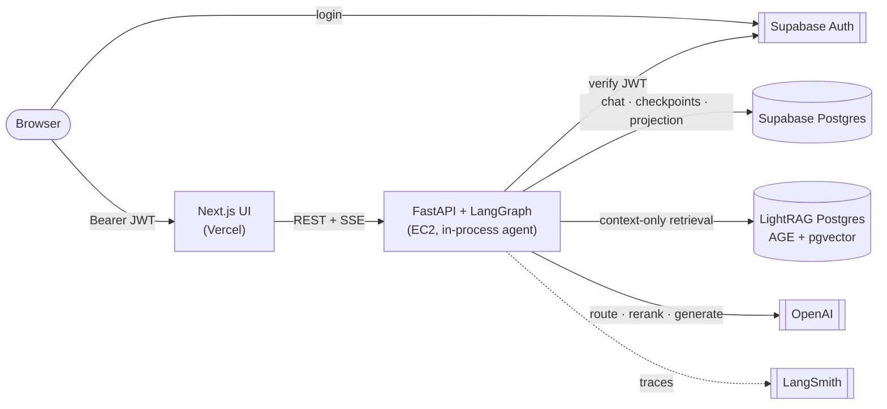
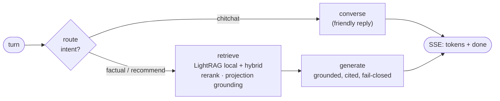

# Reel — GraphRAG Movie Assistant

Reel is a movie Q&A and recommendation assistant. Natural-language questions are
grounded via **[LightRAG](https://github.com/HKUDS/LightRAG)** (local + hybrid context
retrieval over a CMU MovieSummaries subset) and answered with citations, alongside an
interactive **Movie/Person/Genre** knowledge graph. A FastAPI backend with Supabase JWT
auth serves a Next.js chat app, and the LangGraph agent runs **in-process** inside the
backend.

The distinguishing design choice: the LLM **never writes queries**. Retrieval is
context-only and the graph is *deterministic and acyclic* (`route → converse | retrieve →
generate`), which removes the runaway-loop and query-injection failure classes by
construction.

> Full diagrams and deep-dive: **[docs/ARCHITECTURE.md](docs/ARCHITECTURE.md)**.

---

## How it works (at a glance)



**A single chat turn** classifies intent, retrieves grounded context (skipped for small
talk), then streams a cited answer plus a subgraph:



---

## Monorepo layout

`uv`-workspace monorepo. Everything lives under `apps/`:

```text
Demo-Project-1/
├── apps/
│   ├── agents/     # LangGraph deployable: graph, nodes, tools, LightRAG, ingestion
│   ├── backend/    # FastAPI HTTP layer: auth, chat SSE, history, /graph, /ready
│   └── frontend/   # Next.js App Router UI: chat, sources, Sigma graph canvas
├── docs/           # ARCHITECTURE.md + setup guides (deployment, ingestion)
├── infra/aws/      # EC2 deploy: Caddy, cloud-init, prod compose, deploy.sh
├── scripts/        # helper scripts
├── docker-compose.yml
├── pyproject.toml  # [tool.uv.workspace] members = apps/agents, apps/backend
└── uv.lock
```

| Path | Role |
| --- | --- |
| [`apps/agents`](apps/agents) | LangGraph agent — graph, nodes, LightRAG retrieval, hybrid ingestion |
| [`apps/backend`](apps/backend) | FastAPI HTTP layer — auth, chat SSE, chat history, readiness |
| [`apps/frontend`](apps/frontend) | Next.js App Router UI — chat, sources, graph canvas |
| [`docs/`](docs) | Architecture doc + setup guides |
| `datasets/MovieSummaries/` | CMU corpus (not committed; download locally) |

**Placement rule:** graph/retrieval logic lives in `apps/agents`; HTTP transport lives in
`apps/backend` (which imports the compiled graph). `agents` never imports from
`backend`/`frontend`. No reverse imports.

---

## Tech stack

| Layer | Choices |
| --- | --- |
| Frontend | Next.js 16 (App Router), React 19, Tailwind, `@react-sigma` (WebGL graph), zod |
| Backend | FastAPI, `slowapi` rate limiting, `psycopg` pools, structured JSON logging |
| Agent | LangGraph (deterministic graph), LightRAG (AGE + pgvector), OpenAI |
| Data | Supabase Postgres (auth · chat · checkpoints · projection) + LightRAG Postgres |
| Tooling | `uv` workspace, `pnpm`, `ruff`, `pyright`, `pytest`, Vitest, Playwright, Docker |

---

## Prerequisites

- Python **3.11+** and [uv](https://docs.astral.sh/uv/)
- Node **20+** and [pnpm](https://pnpm.io/) (frontend)
- Docker (for local AGE + pgvector Postgres via `docker-compose`)
- Accounts / keys: OpenAI, Supabase (auth + Postgres), TMDB (posters), LangSmith (tracing)

---

## Quick start (local)

### 1. Environment

```bash
cp .env.example .env
# Fill OPENAI_*, RAG_PG_*, SUPABASE_*, TMDB_API_ACCESS_TOKEN, LANGSMITH_*, CORS_ALLOW_ORIGINS
# For local dev, set APP_ENV=dev
```

Frontend also needs `apps/frontend/.env.local` (not committed):

```bash
NEXT_PUBLIC_SUPABASE_URL=...
NEXT_PUBLIC_SUPABASE_ANON_KEY=...
NEXT_PUBLIC_API_URL=http://localhost:8000
```

### 2. Install the Python workspace

```bash
uv sync --group dev
```

### 3. LightRAG Postgres + hybrid ingest

```bash
docker compose up -d rag-postgres

# Place CMU files under datasets/MovieSummaries/, then:
uv run python -m ingestion.ingest --limit 25      # smoke
# uv run python -m ingestion.ingest --limit 1000  # full (hours)
```

Details: [docs/setup/movie-graph-ingestion.md](docs/setup/movie-graph-ingestion.md).

### 4. Backend

```bash
uv run uvicorn api.main:app --reload --app-dir apps/backend/src --port 8000
```

- OpenAPI: `http://localhost:8000/docs`
- Liveness: `GET /health`
- Readiness: `GET /ready` (LightRAG Postgres + Supabase + checkpointer)

### 5. Agent (LangGraph Studio / local CLI) — optional

Production chat traffic goes through the **backend**; this is only for graph debugging:

```bash
cd apps/agents
uv run langgraph dev
```

### 6. Frontend

```bash
cd apps/frontend
pnpm install
pnpm dev
```

Open `http://localhost:3000`, sign in via Supabase, then chat.

### 7. Full Compose stack

```bash
docker compose up --build
```

See [docs/setup/deployment.md](docs/setup/deployment.md) for production topology,
secrets, and CI.

---

## Development commands

```bash
# Python (from repo root)
uv run ruff check .
uv run ruff format --check .
uv run pyright
uv run pytest

# Frontend (from apps/frontend)
pnpm lint
pnpm typecheck
pnpm test          # Vitest unit tests
pnpm test:e2e      # Playwright
```

CI (`.github/workflows/ci.yml`) runs the Python gate (ruff · pyright · pytest) and a
frontend gate (lint · types · unit · build · Playwright) on every PR.

---

## Architecture snapshot

- **Retrieval:** LightRAG `local` (facts) + `hybrid` (plot/theme), context-only; movie
  keys recovered from `movie:{wikipedia_id}` tokens, with a title fallback against the
  projection, and fail-closed when nothing maps.
- **UI graph:** typed Supabase projection tables (`movies`, `people`, `genres`,
  `acted_in`, `in_genre`) — not the LightRAG AGE graph.
- **Memory / auth:** Supabase Postgres checkpointer/store keyed by `thread_id` + JWT
  verified against Supabase JWKS; chat data is ownership-scoped in SQL.
- **Tracing:** LangSmith for ingestion and query-time LLM calls.

Diagrams for every layer (context, containers, topology, agent graph, retrieval, SSE
sequence, auth, data model, ingestion, frontend) live in
**[docs/ARCHITECTURE.md](docs/ARCHITECTURE.md)**.
