# Reel — Architecture

Reel is a **GraphRAG movie assistant**: you ask natural-language questions about films
and it answers with grounded, cited responses plus an interactive knowledge graph.
This document explains how the whole system fits together, from the browser down to
the two Postgres databases, with diagrams for each layer.

> **TL;DR of the design**
>
> - A **deterministic, acyclic** LangGraph agent (`route → converse | retrieve → generate`)
>   — no ReAct loop, so no runaway tool-calling.
> - Retrieval is **context-only** via [LightRAG](https://github.com/HKUDS/LightRAG)
>   (Apache AGE + pgvector). The model **never writes queries** — this closes the
>   Cypher/SQL-injection class of failure by construction.
> - The UI graph and source cards are hydrated from a **typed Supabase projection**
>   (`movies / people / genres / acted_in / in_genre`), kept separate from the RAG store.
> - The agent runs **in-process inside the FastAPI backend** (imported compiled graph),
>   which serves a Next.js frontend over authenticated **SSE**.

- [1. System context (C4 L1)](#1-system-context-c4-l1)
- [2. Containers (C4 L2)](#2-containers-c4-l2)
- [3. Deployment topology](#3-deployment-topology)
- [4. The agent graph](#4-the-agent-graph)
- [5. Retrieval pipeline](#5-retrieval-pipeline)
- [6. Chat request lifecycle (SSE)](#6-chat-request-lifecycle-sse)
- [7. Authentication & authorization](#7-authentication--authorization)
- [8. Data model](#8-data-model)
- [9. Ingestion pipeline](#9-ingestion-pipeline)
- [10. Frontend composition](#10-frontend-composition)
- [11. HTTP API surface](#11-http-api-surface)
- [12. Cross-cutting concerns](#12-cross-cutting-concerns)

---

## 1. System context (C4 L1)

Who and what Reel talks to.

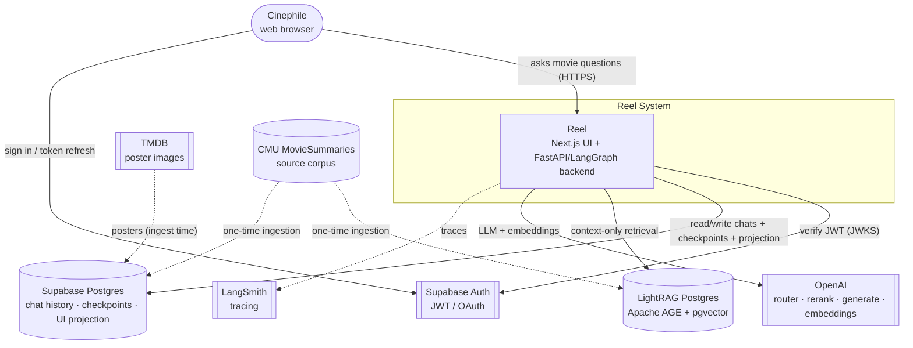

---

## 2. Containers (C4 L2)

The deployable units and how requests flow between them. The agent is **not** a
separate service — the backend imports the compiled LangGraph graph and runs it
in-process.

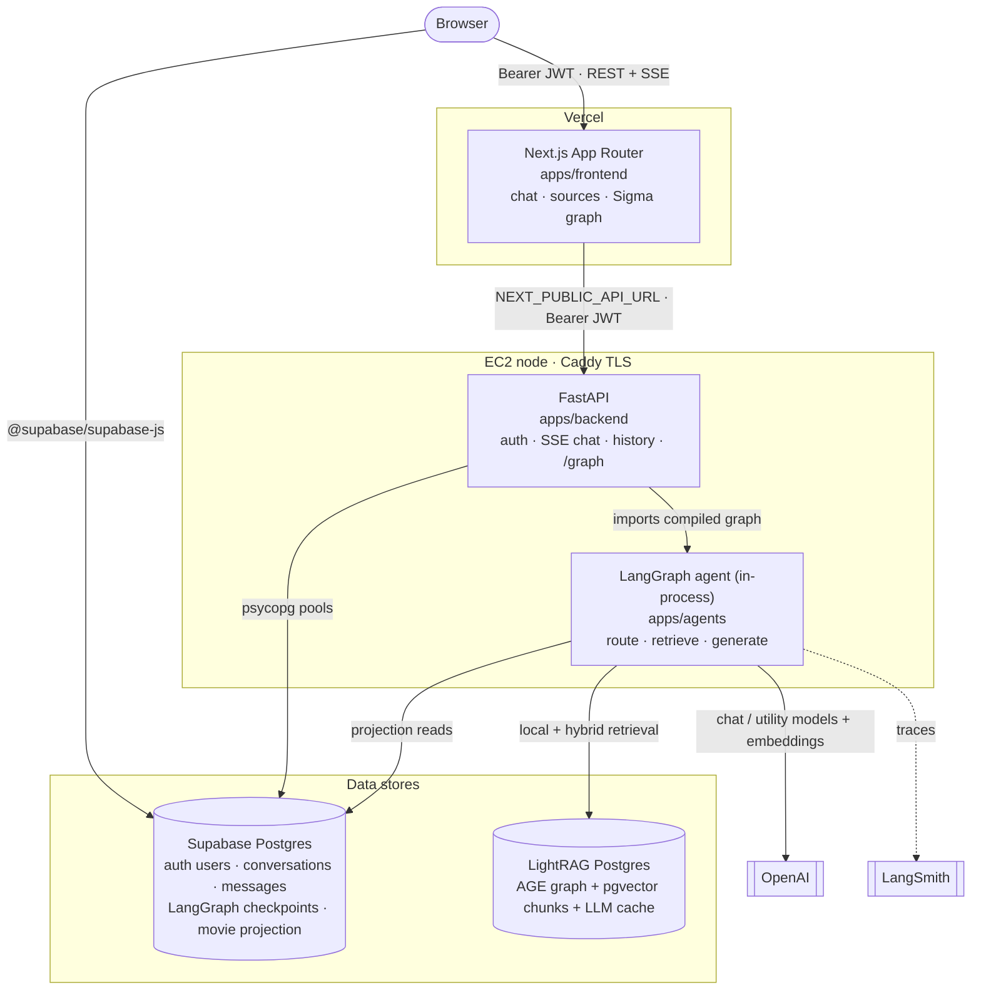

**Placement rule (enforced):** graph/retrieval logic lives in `apps/agents`; HTTP
transport lives in `apps/backend` and imports the compiled graph. `agents` never
imports from `backend`/`frontend`. No reverse imports.

---

## 3. Deployment topology

As built: a single-node MVP with clear horizontal-scaling seams.

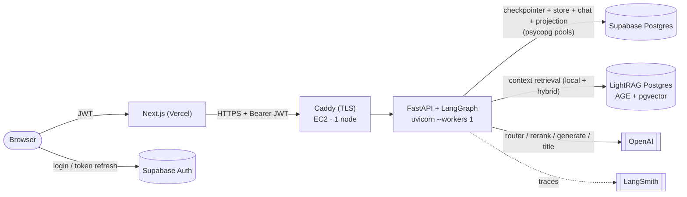

Structural facts:

- The agent runs **in-process** in the backend — no extra network hop, but agent load
  and HTTP load share the same worker.
- **Two Postgres systems**: Supabase (auth + chat + checkpoints + UI projection) and a
  self-hosted **LightRAG Postgres** (AGE + pgvector).
- The frontend is a separate origin on Vercel; the backend is one EC2 node behind Caddy.
- State lives in Postgres (JWT auth is stateless; conversation state is checkpointed by
  `thread_id`), so the design is *mostly* stateless and horizontally scalable once the
  in-process rate limiter and full-graph cache are moved to a shared store.

---

## 4. The agent graph

A **deterministic, acyclic** graph. `route` classifies the turn; greetings skip
retrieval, everything else is grounded. Every node has a `RetryPolicy(max_attempts=3)`.

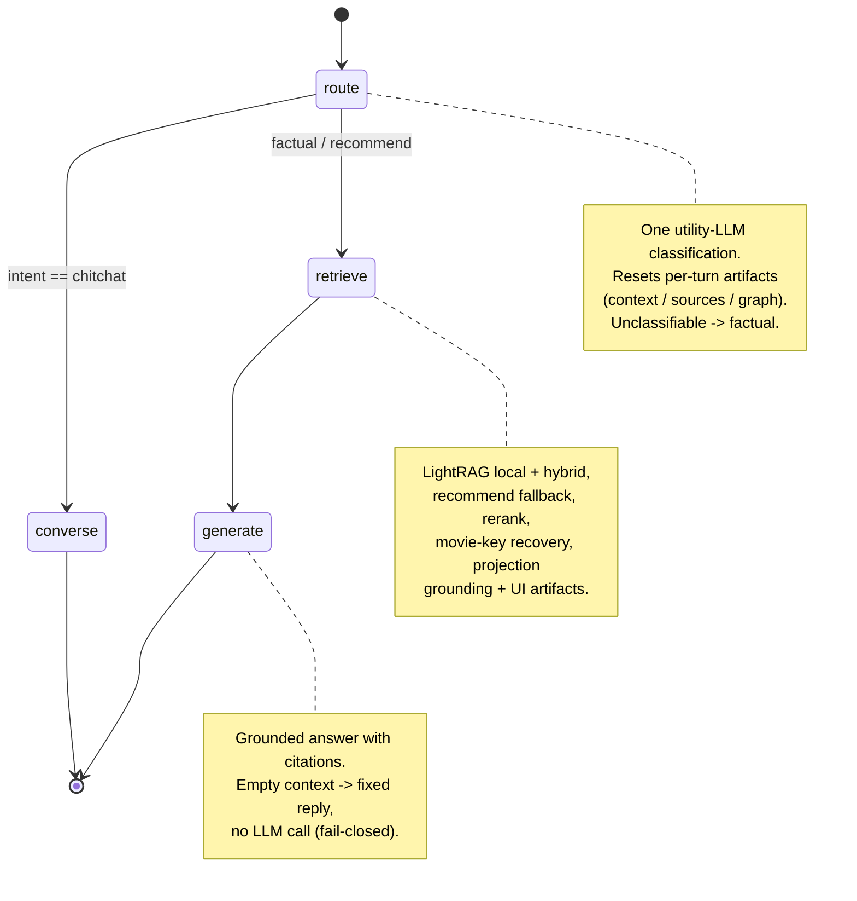

`AgentState` (a `TypedDict`) carries the turn:

| Field | Reducer | Meaning |
| --- | --- | --- |
| `messages` | `add_messages` (append) | Full chat history |
| `intent` | last-write-wins | `factual` \| `recommend` \| `chitchat` |
| `context` | last-write-wins | Merged, reranked grounding text |
| `sources` | last-write-wins | Movie cards for the right pane |
| `graph` | last-write-wins | Person–movie subgraph for the answer |
| `errors` | `operator.add` (append) | Non-fatal retrieval/generation issues |

---

## 5. Retrieval pipeline

What happens inside `retrieve` for a factual/recommend turn. The model only ever
receives **context** — it never generates a query.

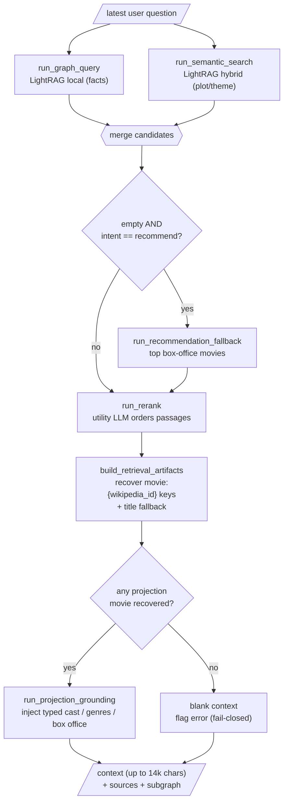

Key behaviors:

- **Fail-closed:** if retrieved text can't be mapped to a projection movie, the context
  is blanked so `generate` returns the fixed empty-context reply instead of fabricating.
- **Projection grounding:** LightRAG plot extraction often yields *character* entities
  without actor names, so typed cast/genre/box-office data is injected from Supabase to
  make "who starred in …" answerable.
- **Context cap:** merged context is truncated to `MAX_GENERATION_CONTEXT_CHARS = 14_000`.

---

## 6. Chat request lifecycle (SSE)

One `POST /chat` turn, from click to streamed answer.

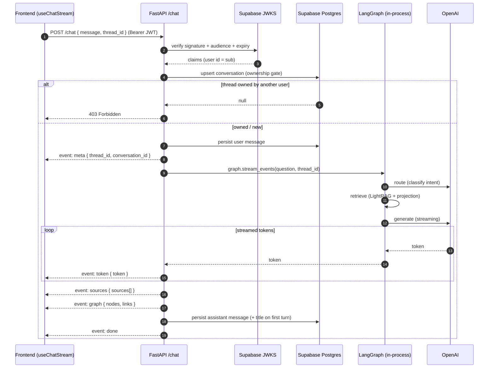

The frontend parses each SSE frame with a validated discriminated union
(`meta | token | sources | graph | done`); malformed frames are skipped rather than
killing the stream.

---

## 7. Authentication & authorization

Auth is stateless (JWT verified per request against Supabase JWKS). Route protection
exists at the edge (Next.js `proxy.ts`) **and** the API (every data/LLM route requires a
Bearer token). Ownership is enforced in SQL.

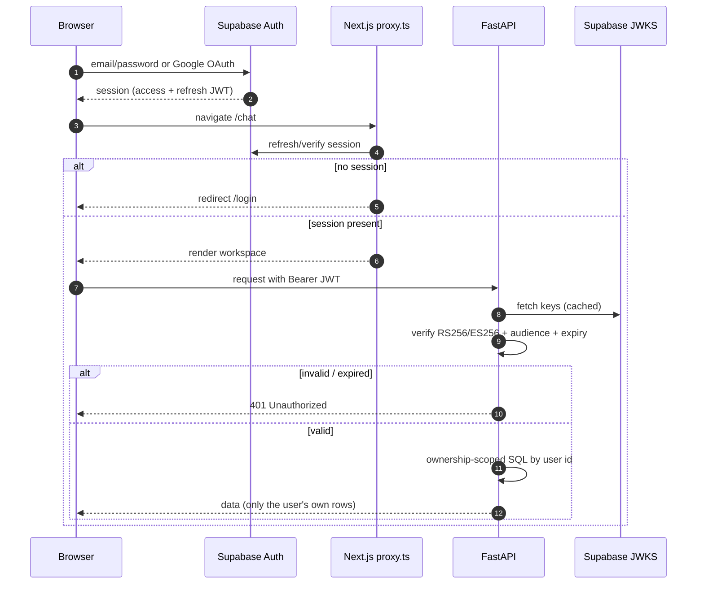

- **Verification:** cached `PyJWKClient`, fixed algorithms (`RS256`/`ES256` — no `none`),
  audience check; JWKS URL derived from the configured Supabase project.
- **Ownership:** `conversations` upsert uses `ON CONFLICT … WHERE user_id = EXCLUDED.user_id`
  and returns nothing for a foreign thread → the route responds `403`. Reads/deletes are
  scoped by `(user_id, conversation_id)` and return `404` cross-user.
- **Public routes:** only `/health` and `/ready` (no data exposed).

---

## 8. Data model

Two logical schemas in Supabase Postgres: the **UI projection** (read by the graph) and
**chat history** (read/written per turn). LangGraph checkpoints live in their own
managed tables keyed by `thread_id`.

### UI projection (read for `/graph` and artifact hydration)

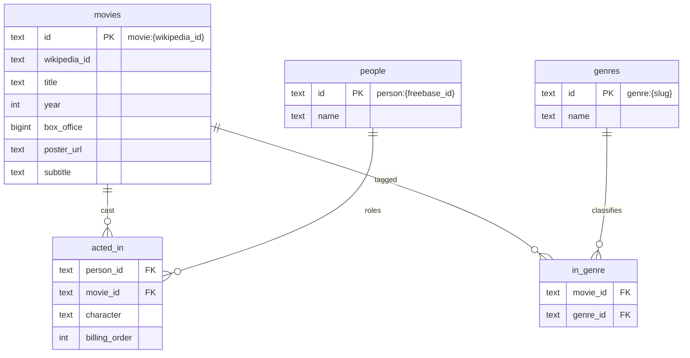

### Chat history (representative)

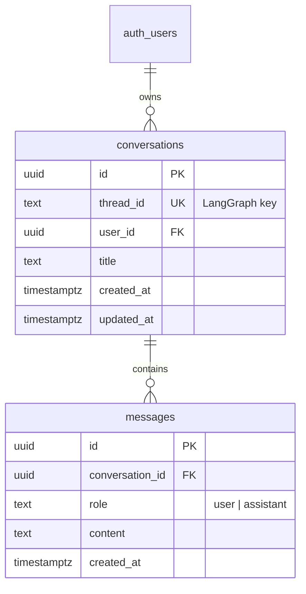

Two databases, **no transactional link** — LightRAG and the projection are populated by
the same ingestion job and are only build-time consistent. When a `movie:{id}` recovered
from LightRAG text is missing from the projection, the system fails closed (drops the
unmapped movie) rather than erroring.

---

## 9. Ingestion pipeline

A one-time (re-runnable) hybrid load from the CMU corpus into **both** stores.

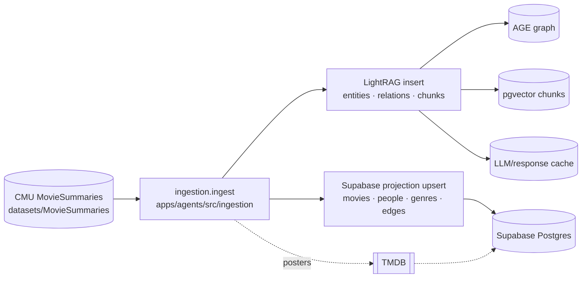

Run it with a small `--limit` first for a smoke test; the full subset takes hours.
See [`docs/setup/movie-graph-ingestion.md`](setup/movie-graph-ingestion.md).

---

## 10. Frontend composition

`ChatWorkspace` is a thin composition of custom hooks (state) and presentational
components (view). Business logic lives in hooks and pure `lib/` helpers; the API layer
is centralized and validated with zod.

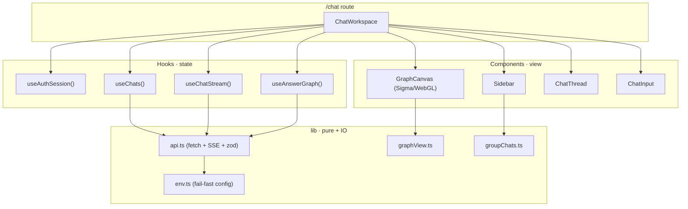

- **Route guard:** `proxy.ts` (Next.js middleware) protects `/chat` and `/login`.
- **Resilient stream:** `streamChat` is a typed async generator; a single bad SSE frame
  is skipped, not fatal.
- **Fail-fast env:** `env.ts` throws on missing/placeholder `NEXT_PUBLIC_*` at load.

---

## 11. HTTP API surface

| Method | Path | Auth | Purpose |
| --- | --- | --- | --- |
| `GET` | `/health` | public | Liveness |
| `GET` | `/ready` | public | Readiness (LightRAG PG + Supabase + checkpointer), `503` on failure |
| `POST` | `/chat` | Bearer | Stream a grounded answer as SSE (`meta`/`token`/`sources`/`graph`/`done`) |
| `GET` | `/chats` | Bearer | List the user's conversations (newest first) |
| `GET` | `/chats/{id}` | Bearer | Fetch one conversation + messages (`404` if not owned) |
| `DELETE` | `/chats/{id}` | Bearer | Delete a conversation (`404` if not owned) |
| `GET` | `/graph` | Bearer | Full movie knowledge graph for the canvas |

OpenAPI/Swagger is served at `/docs` when the backend runs.

---

## 12. Cross-cutting concerns

- **Resilience:** eager fail-fast `lifespan` (graph + pools built at boot); per-node
  `RetryPolicy`; fail-closed retrieval; generic `500` body with a `request_id` (never
  leaks internals).
- **Observability:** structured JSON logs + request-ID middleware at the HTTP edge;
  LangSmith tracing bridged into the process env so backend-driven runs are traced.
- **Security:** parameterized SQL, no model-generated queries, JWT + ownership scoping,
  explicit CORS allowlist in prod, security headers, secrets kept in env only.
- **Performance:** `@lru_cache` LLM client singletons (each with `timeout` + `max_tokens`),
  a LightRAG singleton behind an `asyncio.Lock`, pooled Postgres connections, gzip, and a
  cached full-graph snapshot. Sync work (psycopg, the sync LangGraph iterator) is offloaded
  via `run_in_threadpool` / `iterate_in_threadpool` so the event loop stays responsive.

For the deeper trade-off analysis (caching TTLs, scaling seams, cost model, SPOFs), see
the review notes and [`docs/setup/deployment.md`](setup/deployment.md).
