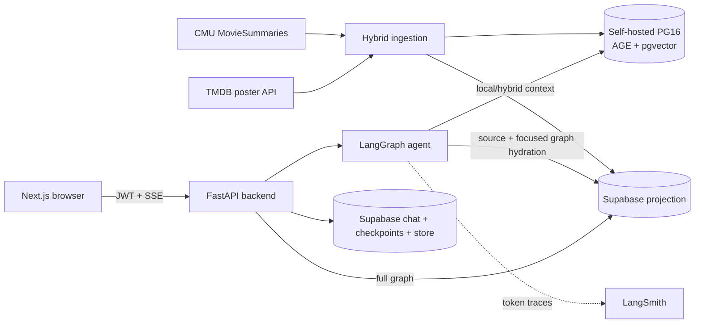

# Reel — System Design Review

**Reviewed:** 2026-07-15
**Focus:** LightRAG migration architecture, data boundaries, consistency,
retrieval flow, resilience, and deployment topology.

## Architecture

There are deliberately two graphs:

- LightRAG's extracted graph is engine-internal and lives in AGE Postgres.
- The typed Movie/Person/Genre graph lives in Supabase and is the only graph
  rendered by the frontend.

The split prevents free-form extracted entities from breaking the established
Sigma graph contract.

## Request lifecycle

1. FastAPI authenticates the Supabase JWT and rate-limits the chat request.
2. LangGraph routes the turn to conversation or grounded retrieval.
3. Retrieval runs LightRAG local and hybrid context-only searches.
4. The reranker scores bounded prompt excerpts but preserves original context,
   including `movie:{wikipedia_id}` file-path tokens.
5. Artifact hydration recovers explicit keys first and projection titles
   second, then loads source cards and the focused graph in one pooled query.
6. If no projection movie can be recovered, context is discarded and
   generation fails closed.
7. The answer and artifacts stream over SSE and chat state persists in
   Supabase.

## Consistency model

LightRAG and Supabase cannot share a transaction. Ingestion therefore uses:

- deterministic subset selection;
- stable IDs;
- idempotent projection upserts and edge refreshes;
- LightRAG document-status resumability;
- post-load counts and referential-integrity checks.

A failure after one database commits can leave the stores temporarily
inconsistent. Rerunning the same ingestion command is the recovery mechanism.

## Concurrency model

Sync LangGraph tools submit all LightRAG coroutines to one persistent
background event loop. This matters because cached async PostgreSQL resources
must not move between loops.

Ingestion is native async and bounds TMDB and LightRAG fan-out with a
semaphore. Supabase ingestion uses one transaction; runtime projection reads
reuse a process-wide psycopg connection pool.

## Security boundaries

- The RAG Postgres role is read/write: LightRAG query caching writes data.
- The backend accesses the projection with a privileged direct Postgres role.
  JWT dependencies on `/graph` and `/chat` are therefore the primary runtime
  authorization boundary.
- The Next.js 16 proxy validates Supabase claims before rendering `/chat` and
  refreshes cookie sessions. This removes the unauthenticated page flash, but
  the backend JWT dependency remains the authoritative data boundary.
- RLS authenticated-read policies protect the separate PostgREST/Data API
  route.
- No model generates SQL or Cypher.
- Empty or unmappable retrieval fails closed.

## Scalability and resilience findings

### Full graph payload

The 1,000-movie subset is intentionally bounded, and `full_graph()` caches a
successful snapshot. If the corpus grows substantially, add pagination,
server-side sampling, or level-of-detail graph endpoints.

### Cache freshness

The full graph cache has no TTL. Restart the backend or explicitly clear the
cache after ingestion. A future ingestion control plane should publish a
cache-invalidation event.

### Dependency outages

LLM calls are bounded and `/ready` checks both databases and the checkpointer,
but there is no circuit breaker. Sustained OpenAI or RAG Postgres outages can
consume retry/thread capacity. Add an open/half-open breaker before scaling to
multiple public replicas.

### Rate limits

Current slowapi counters are per-process. Multi-replica production should use
a shared Redis/gateway limit.

### Streaming persistence

Assistant persistence occurs at stream completion. A disconnect can leave a
saved user turn without its assistant turn. A durable background write or
reconciliation job would strengthen this path.

### Deployment topology

The Compose `agent` service is for Studio/development. Public production
traffic should use the backend service (one worker per LightRAG working
directory) or a supported LangGraph production runtime.

## Verification boundary

Static checks validate contracts and pure behavior, but cannot establish
retrieval quality. Completion requires:

- frontend Vitest boundary/helper tests and mocked Playwright UX coverage;
- a healthy AGE+pgvector container;
- the 25-movie smoke ingest;
- a manual local/hybrid query proving key recovery;
- validation of the chosen deterministic subset (currently 503 movies);
- source/result/full graph UI checks;
- LangSmith token trace and cost verification.

The smoke checks passed and the current data plane is initialized as a
consistent 503-movie deterministic subset. The original 1,000-movie target was
paused at the OpenAI API limit and can resume from LightRAG document status.
