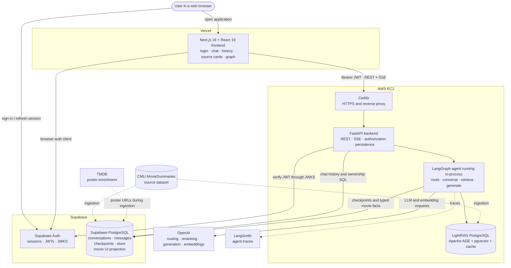
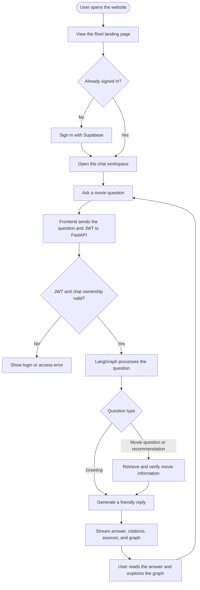
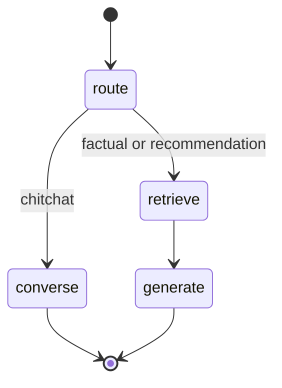
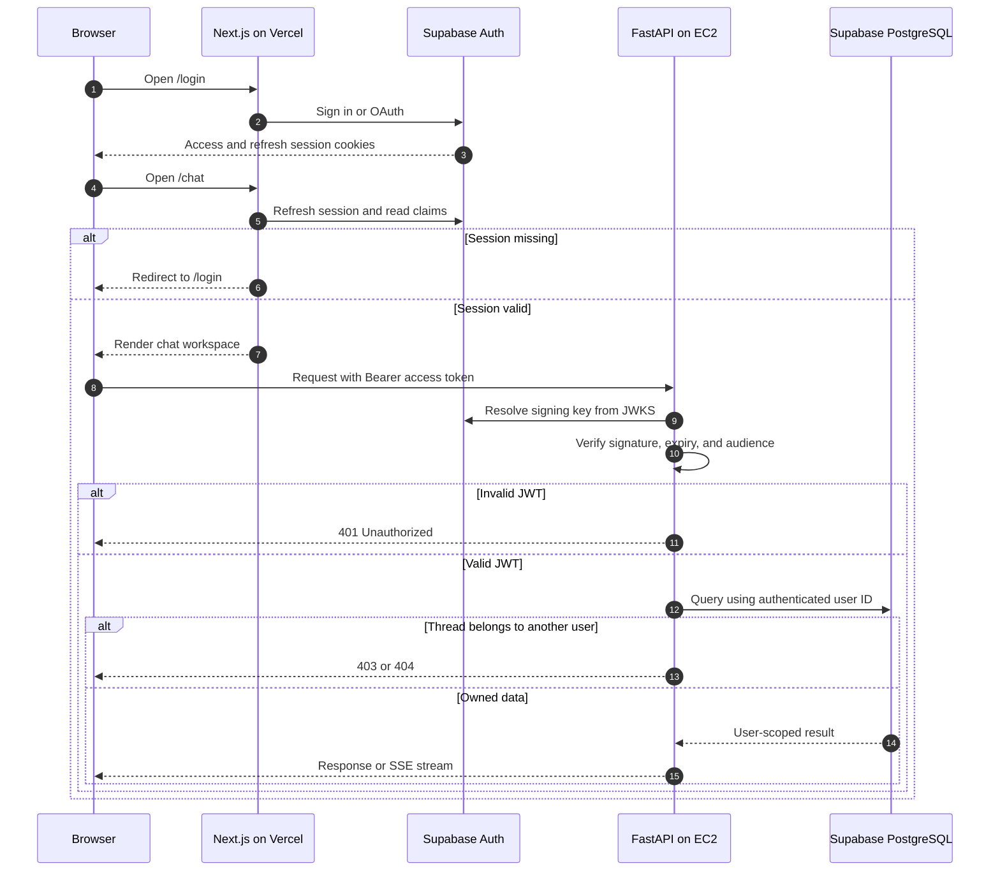
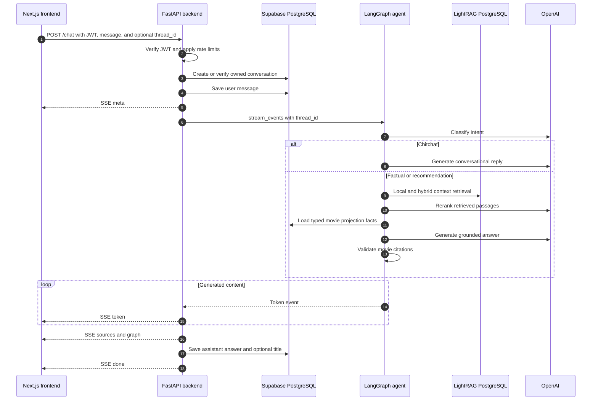
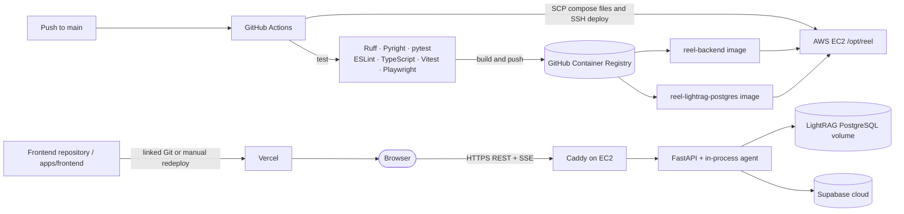

# Reel System Overview

Reel is a GraphRAG movie question-answering and recommendation application. An
authenticated user can ask natural-language movie questions, receive a streamed answer
with stable citations, inspect source cards, and explore the related
Movie–Person–Genre knowledge graph.

This document describes the frontend, backend, AI agent, authentication, databases,
external services, and production deployment.

## 1. Complete system connection



The production chat path does **not** deploy the agent as a separate service. FastAPI
imports and compiles the LangGraph graph in the backend process.

### Simple user journey



## 2. Frontend

Location: [`apps/frontend`](../apps/frontend)

The frontend is a Next.js App Router application written in TypeScript and React.

### Frontend responsibilities

- Render the landing, login, callback, and authenticated chat routes.
- Authenticate users through the Supabase browser client.
- Protect `/chat` and redirect authenticated users away from `/login`.
- List, select, and delete the current user's conversations.
- Send chat messages to the backend with a Supabase access token.
- Parse streamed Server-Sent Events without blocking the interface.
- Display tokens as they arrive.
- Display cited movie source cards.
- Render focused and full knowledge graphs using Sigma/WebGL.
- Validate network payloads with Zod.

### Main frontend files

| File | Responsibility |
| --- | --- |
| `app/page.tsx` | Public landing page |
| `app/(auth)/login/page.tsx` | Login interface |
| `app/auth/callback/route.ts` | Supabase authentication callback |
| `app/chat/page.tsx` | Authenticated chat route |
| `components/ChatWorkspace.tsx` | Main workspace composition |
| `components/GraphCanvas.tsx` | Knowledge-graph controls and presentation |
| `components/SigmaGraphRuntime.tsx` | WebGL graph runtime |
| `hooks/useAuthSession.ts` | Browser authentication state |
| `hooks/useChats.ts` | Conversation history state |
| `hooks/useChatStream.ts` | Streaming chat state |
| `hooks/useAnswerGraph.ts` | Focused and full graph state |
| `lib/api.ts` | REST client, SSE parser, and Zod schemas |
| `proxy.ts` | Next.js route guard |
| `lib/supabaseProxy.ts` | Cookie refresh and authentication redirects |

### Frontend libraries

- Next.js 16
- React 19 and React DOM
- TypeScript
- Tailwind CSS
- `@supabase/supabase-js` and `@supabase/ssr`
- Zod
- `@react-sigma/core`
- `@react-sigma/layout-forceatlas2`
- Graphology

## 3. Backend

Location: [`apps/backend`](../apps/backend)

The backend is a FastAPI application. It is the only public API and contains the
production LangGraph agent in the same process.

### Backend responsibilities

- Verify Supabase bearer JWTs.
- Apply CORS, gzip, request IDs, structured logging, and rate limits.
- Enforce conversation ownership in SQL.
- Create, list, read, and delete chat conversations.
- Invoke the LangGraph graph with a `thread_id`.
- Convert LangGraph v3 events into Server-Sent Events.
- Persist completed user and assistant messages.
- Roll back an incomplete user message after a timeout, cancellation, or disconnect.
- Serve the complete Movie–Person–Genre graph.
- Report liveness and dependency readiness.

### HTTP API

| Method | Route | Authentication | Purpose |
| --- | --- | --- | --- |
| `GET` | `/health` | Public | Process liveness |
| `GET` | `/ready` | Public | Supabase, checkpointer, and LightRAG readiness |
| `POST` | `/chat` | Bearer JWT | Stream one agent turn |
| `GET` | `/chats` | Bearer JWT | List the user's conversations |
| `GET` | `/chats/{id}` | Bearer JWT | Read an owned conversation |
| `DELETE` | `/chats/{id}` | Bearer JWT | Delete an owned conversation |
| `GET` | `/graph` | Bearer JWT | Load the full UI knowledge graph |

### Chat stream events

The backend emits:

- `meta`: thread and conversation IDs
- `token`: one generated text delta
- `sources`: cited movie cards
- `graph`: focused graph nodes and links
- `error`: safe error code and request ID
- `done`: stream completion

The browser validates these events and skips isolated malformed frames.

### Main backend files

| File | Responsibility |
| --- | --- |
| `src/api/main.py` | FastAPI factory, lifespan, middleware, and graph construction |
| `src/api/auth.py` | JWT verification |
| `src/api/routes/chat.py` | Streaming chat endpoint |
| `src/api/routes/chats.py` | Conversation endpoints |
| `src/api/routes/graph.py` | Full knowledge-graph endpoint |
| `src/api/routes/health.py` | Health and readiness endpoints |
| `src/api/services/streaming.py` | LangGraph-to-SSE orchestration |
| `src/api/services/chats.py` | Ownership-scoped chat persistence |
| `src/api/db.py` | PostgreSQL connection pool |
| `src/api/limiter.py` | IP and authenticated-user rate limits |

## 4. AI agent

Location: [`apps/agents`](../apps/agents)

The agent is a deterministic, acyclic LangGraph workflow. It does not use a ReAct loop
and does not let the language model create SQL or graph queries.



### Agent nodes

1. **`route`**
   - Classifies the latest message as `factual`, `recommend`, or `chitchat`.
   - Clears previous per-turn context, sources, graph data, and errors.
   - Defaults to `factual` when classification fails.

2. **`converse`**
   - Handles greetings and small talk.
   - Does not query the movie stores.

3. **`retrieve`**
   - Runs LightRAG `local` retrieval for graph-oriented facts.
   - Runs LightRAG `hybrid` retrieval for semantic plot and theme matches.
   - Uses top box-office projection rows as a recommendation fallback.
   - Reranks candidates with a utility language model.
   - Recovers stable `movie:{wikipedia_id}` keys.
   - Hydrates source cards and a focused graph from Supabase.
   - Adds typed cast, genre, year, and box-office facts.
   - Limits generation context to complete passages within 14,000 characters.

4. **`generate`**
   - Generates an answer using only retrieved context.
   - Requires citations in `Movie Title [movie:id]` form.
   - Validates citation IDs and title matches against the retrieved sources.
   - Returns a fixed empty-context response if grounding is unavailable or invalid.

Every node has a LangGraph retry policy with at most three attempts.

### Agent state

| Field | Purpose |
| --- | --- |
| `messages` | Checkpointed conversation messages |
| `intent` | Current routed intent |
| `context` | Reranked grounding text |
| `sources` | Movie cards sent to the frontend |
| `graph` | Focused Movie–Person–Genre graph |
| `errors` | Sanitized non-fatal retrieval errors |

### Main agent files

| File | Responsibility |
| --- | --- |
| `src/agents/graph.py` | Graph nodes, edges, and retry policies |
| `src/agents/state.py` | Agent state schema |
| `src/agents/nodes.py` | Route, converse, retrieve, and generate logic |
| `src/agents/tools.py` | Fixed retrieval and reranking functions |
| `src/agents/lightrag_service.py` | LightRAG configuration and OpenAI callbacks |
| `src/agents/projection.py` | Typed Supabase projection queries |
| `src/agents/artifacts.py` | Source-card and graph artifact construction |
| `src/agents/memory.py` | PostgreSQL checkpointer and store |
| `src/agents/clients.py` | Chat, utility, embedding, and tracing clients |
| `src/ingestion/ingest.py` | CMU, TMDB, LightRAG, and projection ingestion |

The functions in `tools.py` are ordinary fixed Python functions. They are not exposed
to a free-running `ToolNode`.

## 5. Authentication and authorization

Supabase provides user authentication. Protection is applied in both the frontend and
backend.



### Authentication controls

- The frontend refreshes Supabase cookies before protected routes render.
- The API accepts bearer tokens only.
- JWT signing keys come from the project's Supabase JWKS endpoint.
- Only `RS256` and `ES256` are accepted.
- The configured JWT audience is validated.
- The JWT `sub` claim becomes the application user ID.
- Conversation reads, deletes, and upserts include ownership conditions.
- Cross-user resources return `403` or `404`.
- `/health` and `/ready` are the only public backend routes.
- The frontend uses the public Supabase anon key, never a service-role key.

## 6. Data stores and external services

### Supabase

Supabase has two roles:

1. **Authentication**
   - User signup, login, OAuth, token refresh, JWT signing, and JWKS.

2. **PostgreSQL application data**
   - `conversations` and `messages`
   - LangGraph checkpoint and store tables
   - `movies`, `people`, and `genres`
   - `acted_in` and `in_genre` relationships

The projection is deliberately typed and separate from the internal LightRAG graph.
It supplies stable frontend entities and additional grounding facts.

### LightRAG PostgreSQL

The self-hosted PostgreSQL container stores:

- Apache AGE entities and relationships
- pgvector embeddings and chunks
- document-processing status
- key-value data and LLM response cache

Supabase is not used for this store because managed Supabase does not provide Apache
AGE. Neo4j and Qdrant are not part of the current runtime architecture.

### OpenAI

OpenAI models provide:

- intent classification
- retrieval reranking
- grounded answer generation
- LightRAG extraction/query operations
- text embeddings
- optional conversation title generation

### Other services

- **LangSmith:** optional graph and model tracing.
- **TMDB:** resolves poster URLs during ingestion.
- **CMU MovieSummaries:** supplies movie metadata, plots, genres, and cast source data.

## 7. Chat request lifecycle



## 8. Ingestion

The ingestion command is:

```bash
uv run python -m ingestion.ingest --limit 503
```

It:

1. Loads CMU plot, movie, and character files.
2. Joins movies with metadata and cast.
3. Selects a deterministic top-box-office subset.
4. Reuses existing posters and requests missing ones from TMDB.
5. Upserts movies, people, genres, and edges into Supabase.
6. Inserts one document per movie into LightRAG.
7. Validates row counts, foreign keys, and LightRAG document status.

Both stores are populated by the same job, but there is no transaction spanning
Supabase and LightRAG PostgreSQL. If retrieved data cannot be mapped to a Supabase
movie, the agent fails closed.

## 9. Production deployment



### Vercel

- Deploys `apps/frontend`.
- Builds the Next.js application with:
  - `NEXT_PUBLIC_SUPABASE_URL`
  - `NEXT_PUBLIC_SUPABASE_ANON_KEY`
  - `NEXT_PUBLIC_API_URL`
- Communicates directly with Supabase Auth and the HTTPS backend.
- The repository has no `vercel.json`; deployment is expected to be configured through
  a linked Vercel project or manual deployment.
- The GitHub Actions workflow tests and builds the frontend, but does not explicitly
  deploy it to Vercel.

### AWS EC2

Production Compose runs:

- `caddy`
- `backend`
- `rag-postgres`

The `agent` development container and frontend container are intentionally omitted.
Caddy listens on ports 80 and 443, provisions TLS, and proxies traffic to
`backend:8000`.

Persistent Docker volumes hold:

- LightRAG PostgreSQL data
- LightRAG working-directory files
- Caddy certificates and configuration

### GitHub Actions and GHCR

For pushes to `main`, CI:

1. Runs Python and frontend quality gates.
2. Builds the backend image.
3. Builds the PostgreSQL image containing AGE and pgvector.
4. Pushes both images to GitHub Container Registry.
5. Copies Compose, Caddy, and deployment files to EC2.
6. Connects over SSH and runs the deployment script.

Live golden agent evaluations run in a separate, opt-in workflow. Another manual
workflow can restore a LightRAG PostgreSQL dump to EC2.

## 10. Important production environment variables

### Frontend

```text
NEXT_PUBLIC_SUPABASE_URL
NEXT_PUBLIC_SUPABASE_ANON_KEY
NEXT_PUBLIC_API_URL
```

### Backend and agent

```text
APP_ENV=prod
CORS_ALLOW_ORIGINS
SUPABASE_URL
SUPABASE_JWT_AUD
SUPABASE_DB_URL
OPENAI_API_KEY
OPENAI_CHAT_MODEL
OPENAI_EMBED_MODEL
LANGSMITH_TRACING
LANGSMITH_API_KEY
LANGSMITH_PROJECT
LLM_TIMEOUT_SECONDS
LLM_MAX_TOKENS
CHAT_STREAM_TIMEOUT_SECONDS
```

### LightRAG PostgreSQL variables

```text
RAG_PG_HOST=rag-postgres
RAG_PG_PORT=5432
RAG_PG_USER
RAG_PG_PASSWORD
RAG_PG_DATABASE
RAG_PG_WORKSPACE
LIGHTRAG_WORKING_DIR=/data/lightrag
```

Secrets belong in Vercel environment settings, GitHub Actions secrets, Supabase, or
`/opt/reel/.env` on EC2. `.env`, frontend `.env.local`, database passwords, service-role
keys, and API keys must not be committed.

## 11. Local development

```bash
# Install Python workspace dependencies
uv sync --group dev

# Start LightRAG PostgreSQL
docker compose up -d rag-postgres

# Run backend
uv run uvicorn api.main:app --reload --app-dir apps/backend/src --port 8000

# Run frontend
cd apps/frontend
pnpm install
pnpm dev
```

The optional `agent` Compose service or `uv run langgraph dev` command is for LangGraph
Studio and local graph debugging only.

## 12. Technology summary

| Area | Technologies |
| --- | --- |
| Languages | Python 3.11+, TypeScript, TSX, CSS, embedded SQL, YAML, Bash |
| Frontend | Next.js, React, Tailwind CSS, Zod |
| Visualization | Sigma.js, React Sigma, Graphology, ForceAtlas2, WebGL |
| Backend | FastAPI, Uvicorn, Pydantic, SlowAPI, PyJWT, psycopg |
| AI | LangGraph, LangChain, LightRAG, OpenAI, LangSmith |
| Data | Supabase PostgreSQL, Apache AGE, pgvector |
| Infrastructure | Docker Compose, Caddy, AWS EC2, Vercel, GHCR |
| Testing | pytest, Ruff, Pyright, Vitest, Playwright, ESLint |

For lower-level diagrams and data models, see
[`docs/ARCHITECTURE.md`](ARCHITECTURE.md). For operational commands, see
[`docs/setup/deployment.md`](setup/deployment.md).
