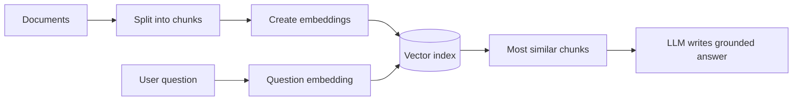
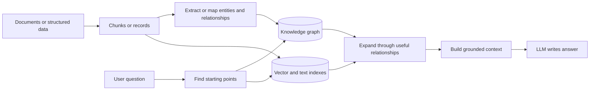
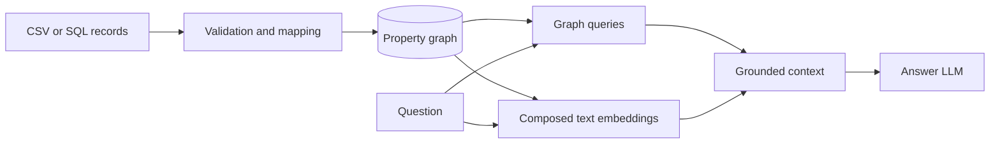

# GraphRAG Approaches Explained in Clear English

> A detailed guide to ordinary RAG, Microsoft GraphRAG, FastGraphRAG,
> LightRAG, Neo4j GraphRAG, LlamaIndex Property Graph RAG, HippoRAG, and
> RAPTOR.
>
> Last reviewed: July 2026

## Contents

1. [The short explanation](#the-short-explanation)
2. [Important words](#important-words)
3. [How ordinary RAG works](#how-ordinary-rag-works)
4. [What GraphRAG changes](#what-graphrag-changes)
5. [Three different meanings of "graph"](#three-different-meanings-of-graph)
6. [The main GraphRAG families](#the-main-graphrag-families)
7. [Microsoft GraphRAG](#microsoft-graphrag)
8. [Microsoft FastGraphRAG](#microsoft-fastgraphrag)
9. [LightRAG](#lightrag)
10. [Neo4j GraphRAG](#neo4j-graphrag)
11. [LlamaIndex Property Graph RAG](#llamaindex-property-graph-rag)
12. [LangChain GraphRAG patterns](#langchain-graphrag-patterns)
13. [HippoRAG](#hipporag)
14. [RAPTOR](#raptor)
15. [Structured knowledge-graph RAG](#structured-knowledge-graph-rag)
16. [Comparison table](#comparison-table)
17. [Why Microsoft GraphRAG is usually more expensive](#why-microsoft-graphrag-is-usually-more-expensive)
18. [Indexing cost versus question cost](#indexing-cost-versus-question-cost)
19. [Retrieval methods explained](#retrieval-methods-explained)
20. [Accuracy and failure modes](#accuracy-and-failure-modes)
21. [Updating the data](#updating-the-data)
22. [How to choose](#how-to-choose)
23. [Recommendation for the Reel movie project](#recommendation-for-the-reel-movie-project)
24. [A sensible evaluation plan](#a-sensible-evaluation-plan)
25. [Glossary](#glossary)
26. [Official references](#official-references)

## The short explanation

**RAG** means that an application searches external information before asking
an LLM to answer.

**Ordinary RAG** searches pieces of text that look similar to the question.

**GraphRAG** also uses connections between things. For example:

```text
Christopher Nolan --DIRECTED--> Inception
Inception --HAS_GENRE--> Science Fiction
Leonardo DiCaprio --ACTED_IN--> Inception
```

The word **GraphRAG** does not name one fixed algorithm. It is a broad name for
several systems that use graphs in different ways:

- Microsoft GraphRAG builds a detailed graph and hierarchical community
  reports from unstructured text.
- FastGraphRAG is Microsoft's cheaper indexing method. It replaces expensive
  LLM extraction with traditional NLP for part of the pipeline.
- LightRAG combines a lightweight knowledge graph with vector retrieval and
  supports local, global, hybrid, naive, and mix retrieval modes.
- Neo4j GraphRAG is a toolkit for retrieving from a Neo4j property graph. The
  graph may already exist, or an extraction pipeline may build it.
- LlamaIndex Property Graph RAG is a configurable framework for extracting,
  storing, and retrieving property-graph data.
- HippoRAG builds a schemaless graph and uses Personalized PageRank to spread
  relevance through connected knowledge.
- RAPTOR builds a tree of recursively summarized text. It is graph-shaped, but
  it is not normally a real-world entity knowledge graph.

There is no universally best type. The best choice depends on:

1. Whether the source is structured data or unstructured prose.
2. Whether questions are factual, multi-hop, thematic, or corpus-wide.
3. How often the data changes.
4. How much indexing cost and engineering complexity are acceptable.
5. Whether the graph must be inspected or queried directly.

## Important words

### LLM

A Large Language Model, such as an OpenAI, Anthropic, Google, or open-source
model. It reads and generates text.

### Document

A source item such as a PDF, article, report, web page, movie description, or
database record.

### Chunk or text unit

A smaller piece of a document. Long documents are split because embedding and
LLM models have context limits, and smaller units are easier to retrieve.

### Embedding

A list of numbers representing the meaning of some text. Texts with similar
meanings usually have nearby embeddings.

### Vector search

Searching for embeddings that are mathematically close to the question's
embedding.

### Entity

A distinct thing, such as a person, movie, company, place, product, or event.

### Relationship

A connection between two entities, such as:

```text
Person --WORKS_AT--> Company
Movie --IN_GENRE--> Genre
Company --ACQUIRED--> Company
```

### Knowledge graph

A network of entities and relationships. It normally represents real-world
meaning rather than only text similarity.

### Indexing

The offline preparation stage. It can include splitting documents, extracting
entities, creating relationships, generating summaries, making embeddings, and
writing everything to storage.

### Retrieval

The online search stage that runs after the user asks a question.

### Generation

The final LLM call that receives the retrieved evidence and writes the answer.

## How ordinary RAG works

Ordinary vector RAG usually follows this process:



### Indexing stage

1. Load documents.
2. Clean the text.
3. Split it into chunks.
4. Create one embedding per chunk.
5. Store the chunk and embedding in a vector database or vector index.

### Question stage

1. Create an embedding for the question.
2. Find the nearest chunk embeddings.
3. Optionally rerank the chunks.
4. Put the best chunks into the LLM prompt.
5. Ask the LLM to answer only from that evidence.

### What ordinary RAG does well

- It is simple.
- It is relatively cheap.
- It works well for questions answered by one or two passages.
- Adding documents is normally easy.
- Many databases support it.

### What ordinary RAG struggles with

- A fact may be spread across several documents.
- Two chunks may be connected through an entity but use different wording.
- Similarity does not necessarily mean relevance.
- It can miss multi-hop answers.
- It has no explicit model of relationships.
- Corpus-wide questions such as "What are the main themes?" are difficult
  because the answer may require reading many clusters of information.

## What GraphRAG changes

A generic GraphRAG pipeline adds connected structure:



The important new step is **graph expansion**. After finding a relevant movie,
person, paragraph, or concept, the system can follow relationships to collect
connected evidence.

For example, vector search may find `Inception`. Graph traversal can then add:

- its director;
- its actors;
- its genres;
- related themes;
- source documents;
- other movies connected through the same people or concepts.

The graph does not replace vector search in every design. Many good GraphRAG
systems use both.

## Three different meanings of "graph"

People often mix up three unrelated things.

### 1. Knowledge graph

This is the domain information:

```text
Person --DIRECTED--> Movie
Movie --HAS_KEYWORD--> Keyword
```

This is the graph that GraphRAG normally means.

### 2. Vector-index graph

HNSW vector indexes internally build a graph of nearby vectors to accelerate
approximate nearest-neighbor search.

That internal HNSW graph does **not** mean the database understands domain
relationships. It only knows which vectors are close in mathematical space.

### 3. Workflow graph

Frameworks such as LangGraph represent program execution as nodes and edges:

```text
route -> retrieve -> rerank -> generate
```

This is an application workflow. It is not the movie knowledge graph and not
the HNSW vector index.

An application can use all three graphs at the same time.

## The main GraphRAG families

The easiest way to understand the field is to group systems by how the graph is
created.

### Family A: LLM-built graph from unstructured text

Examples:

- Microsoft GraphRAG Standard
- LightRAG
- HippoRAG
- LlamaIndex with LLM knowledge-graph extractors
- Neo4j KG Builder with an LLM entity/relationship extractor

An LLM reads text and tries to discover entities and relationships. This is
flexible, but extraction costs money and can make mistakes.

### Family B: NLP-built graph from unstructured text

Example:

- Microsoft FastGraphRAG

Traditional language-processing tools identify noun phrases, and co-occurrence
creates connections. This is cheaper but produces a noisier and less meaningful
graph.

### Family C: Deterministic graph from structured data

Examples:

- CSV rows loaded into Neo4j
- SQL tables mapped into graph nodes and relationships
- An application's existing business entities
- A curated ontology or taxonomy

Code defines exactly how records become nodes and relationships. This is often
the cheapest and most reliable choice when good structured data already exists.

### Family D: Hierarchical summaries rather than entity relationships

Example:

- RAPTOR

Chunks are clustered and summarized into a tree. This helps with long documents
and broad themes, but the edges mean "this summary contains these children,"
not real-world relationships such as `DIRECTED` or `WORKS_AT`.

## Microsoft GraphRAG

Microsoft GraphRAG is a configurable indexing and query system designed mainly
for discovering structure in **unstructured narrative text**.

Its special strength is answering broad questions about an entire corpus, not
only finding a passage that resembles the question.

### Microsoft GraphRAG indexing pipeline

The Standard method does roughly the following.

#### Step 1: Load documents

It reads source documents and keeps metadata that can connect generated
information back to its source.

#### Step 2: Create text units

The documents are split into smaller units suitable for LLM extraction,
embedding, and later citation.

The current documented default is 1,200 tokens per text unit. This is a
starting point, not a universal optimum. Larger units reduce the number of
calls but can make extraction and source references less precise.

#### Step 3: Extract entities

An LLM reads each text unit and identifies entities such as people,
organizations, locations, events, and concepts.

It can also write descriptions of those entities.

#### Step 4: Extract relationships

The LLM identifies how entity pairs are connected and writes relationship
descriptions.

Optional claim or covariate extraction can identify statements or claims about
entities.

Claim extraction is disabled by default. Its usefulness depends strongly on a
domain-specific prompt; the default framing is not appropriate for every
corpus.

#### Step 5: Merge and summarize duplicates

The same entity may appear in many text units. GraphRAG combines repeated
descriptions to create a more complete entity or relationship description.

Entity resolution is difficult: "Microsoft," "Microsoft Corp.," and "the
company" may or may not be merged correctly.

#### Step 6: Detect graph communities

Microsoft GraphRAG uses hierarchical community detection based on the Leiden
algorithm.

A community is a group of densely connected entities. Communities can exist at
multiple levels:

- small detailed communities;
- larger communities containing those smaller groups;
- high-level communities representing broad corpus areas.

#### Step 7: Generate community reports

An LLM receives each community's entities, relationships, descriptions, and
optional claims. It writes a report that summarizes:

- what the community is about;
- important entities;
- important relationships;
- major findings;
- supporting evidence.

This report generation happens for many communities and hierarchy levels.

#### Step 8: Generate embeddings

GraphRAG embeds text units and selected generated artifacts such as entity
descriptions and community-report content. The embeddings support semantic
lookup during queries.

### Microsoft GraphRAG query methods

#### Global Search

Global Search is for questions about the corpus as a whole:

- "What are the main themes?"
- "What risks appear across these reports?"
- "How do the major groups disagree?"

The system selects community reports and uses a map-reduce-style process:

1. Several reports are processed separately.
2. Partial answers or points are generated.
3. A final LLM call combines those partial results.

This can answer broad questions that ordinary top-k vector retrieval often
misses.

#### Local Search

Local Search is for an entity or a small neighborhood:

- "What is Company X doing?"
- "Who is connected to Project Y?"
- "What evidence supports this relationship?"

It starts from relevant entities and gathers nearby relationships, text units,
claims, and community information.

In practice, the question embedding is matched against entity-description
embeddings. This means Local Search is only as good as the extracted entities,
their descriptions, and the chosen entity anchors.

#### DRIFT Search

DRIFT combines local exploration with broader community context. It is intended
for questions that need both a specific starting point and wider exploration.

It starts from semantically relevant community reports, creates a broad primer,
generates follow-up questions, and recursively performs more local retrieval.
That breadth is useful, but the additional rounds increase latency and cost.

#### Basic Search

Basic Search is closer to ordinary vector RAG over indexed text.

### Microsoft GraphRAG strengths

- Strong support for corpus-wide thematic questions.
- Rich entity and relationship descriptions.
- Hierarchical summaries at different levels of detail.
- Useful when the graph itself should be explored.
- Provenance can connect generated structures back to source text.
- Configurable prompts and workflows.

### Microsoft GraphRAG weaknesses

- High indexing cost.
- Slow indexing compared with ordinary RAG.
- More generated artifacts to store and maintain.
- Entity extraction and entity resolution can be wrong.
- Community summaries can omit details or introduce summarization errors.
- Large changes may require expensive reprocessing.
- It is operationally more complicated than vector RAG.
- It is often unnecessary when the original data is already structured.

### Microsoft GraphRAG best fit

Use Standard Microsoft GraphRAG when:

- the source is a large unstructured narrative corpus;
- broad corpus-level questions are important;
- graph quality matters;
- people need to inspect the extracted graph;
- indexing can run offline;
- the budget can support many LLM extraction and summarization calls.

Avoid it when:

- a clean graph already exists;
- the use case only needs simple fact lookup;
- documents change constantly;
- cost is the main constraint;
- there is no plan to evaluate extraction and community quality.

## Microsoft FastGraphRAG

Microsoft FastGraphRAG is a lower-cost indexing method in the Microsoft
GraphRAG project. It should not be confused with every other project that uses
the phrase "fast GraphRAG."

### How it differs from Standard GraphRAG

Standard GraphRAG uses an LLM to extract and describe entities and
relationships.

FastGraphRAG uses traditional NLP tools such as noun-phrase extraction:

1. NLP finds noun phrases.
2. Noun phrases become candidate entities.
3. Entities that occur in the same text unit are connected through
   co-occurrence.
4. It skips rich LLM-generated entity and relationship descriptions.
5. It still builds communities.
6. It still uses LLM-generated community reports, but those reports are based
   more directly on source text units.

The current documentation recommends much smaller text units, commonly around
50–100 tokens, so co-occurrence edges are not created between unrelated phrases
inside a large chunk. The default extractors are primarily English-oriented.

### Why it is cheaper

Microsoft's documentation estimates that graph extraction is roughly **75% of
Standard indexing cost**. Removing most of that work explains why the Fast
method can approach roughly one quarter of Standard's relative cost in a
comparable setup. This is not a guaranteed 75% discount: the real result
depends on community reports, corpus size, models, prompts, retries, embeddings,
and token prices.

### Trade-off

Co-occurrence means "these phrases appeared near each other." It does not
necessarily express a meaningful real-world relationship.

Therefore the Fast graph is:

- cheaper;
- faster;
- useful for building community reports;
- noisier;
- less suitable as a high-fidelity standalone knowledge graph.

### FastGraphRAG best fit

Use it when global summaries matter more than precise graph semantics and the
Standard indexing bill is too high.

## LightRAG

LightRAG is designed as a lighter graph-based RAG framework that combines:

- a knowledge graph;
- vector embeddings;
- original text chunks;
- multiple retrieval modes.

It aims to preserve both detailed entity information and broader relationship
information without reproducing Microsoft's full hierarchy of expensive
community-report generation.

### LightRAG indexing

A simplified LightRAG indexing process is:

1. Split documents into chunks.
2. Use an LLM to identify entities and relationships.
3. Create descriptions or summaries used for graph records.
4. Merge matching entities and relationships into the existing graph.
5. Store chunks, entities, and relationships.
6. Create vector indexes for semantic retrieval.
7. Cache LLM extraction results where configured.

LightRAG is not free of LLM indexing cost. It is "light" relative to heavier
graph summarization pipelines, not relative to plain vector RAG.

### LightRAG storage roles

Current LightRAG separates persistence into four responsibilities:

1. key-value storage for chunks, document metadata, caches, and extraction
   results;
2. vector storage for chunks, entities, and relationships;
3. graph storage for entity nodes and relationship edges;
4. document-status storage for indexing state.

These roles can use one unified production backend or several specialized
backends. This flexibility is useful, but coordinating several stores makes
deployment, deletion, backup, and consistency more complicated than ordinary
vector RAG.

### Retrieval modes

LightRAG exposes several modes. Applications should choose the mode explicitly
because defaults can differ between the core library and API integrations.

Graph-enabled modes first use an LLM to extract:

- low-level keywords for concrete entities and concepts;
- high-level keywords for themes and broader relationships.

Those keywords are vector-matched against entity and relationship indexes.
The results are expanded through graph neighbors and linked source chunks.

#### Local

Local mode emphasizes entities and their detailed nearby context.

Good for:

- "Who is this person?"
- "What does this component do?"
- "What happened to this specific product?"

#### Global

Global mode emphasizes relationships and broader themes across connected
knowledge.

Good for:

- "What trends appear across the documents?"
- "How are these subjects connected?"

This is not identical to Microsoft GraphRAG Global Search. The names are
similar, but their indexes and retrieval algorithms differ.

#### Hybrid

Hybrid mode combines local entity information with global relationship
information.

#### Naive

Naive mode behaves like ordinary chunk-based vector RAG and does not rely on
the knowledge graph.

#### Mix

Mix mode combines knowledge-graph retrieval with vector retrieval over original
chunks. It is intended to provide both structured connections and direct source
evidence.

In the current source, `mix` is the default general query mode. Some older
documentation examples still show a different default, so production code
should set the desired mode explicitly.

### Incremental updates

LightRAG emphasizes incremental insertion:

1. Process only the new documents.
2. Build a local graph for them.
3. Merge its nodes and edges into the existing graph.

This is easier than rebuilding a full global hierarchy. Document replacement is
usually handled as delete-then-insert rather than an in-place overwrite.

Deletion can still be complicated because a shared entity description may have
been built from several documents. Current implementations use cached
extraction information to help rebuild affected records.

The current document-deletion flow removes unique chunks, entities, and
relationships while preserving shared graph records. Partially affected shared
records may need their descriptions and vectors rebuilt. The operation must be
coordinated across all storage roles, so it is more complex than deleting
ordinary vector chunks.

### LightRAG strengths

- Graph and vector retrieval are both first-class.
- Several query modes make experiments easy.
- Better incremental-update story than a full community hierarchy.
- Can work with local or hosted LLMs.
- Multiple storage backends are supported.
- Often cheaper than Standard Microsoft GraphRAG.

### LightRAG weaknesses

- LLM graph extraction can still be expensive at scale.
- Entity merging can create incorrect combinations.
- A lightweight graph can be less precise than a curated schema.
- Many configuration choices affect retrieval quality.
- "Local," "global," and "hybrid" names do not guarantee the same behavior as
  similarly named Microsoft methods.
- Framework benchmark claims may not transfer to a different domain, model, or
  dataset.

### LightRAG best fit

Use LightRAG when:

- source data is mainly unstructured text;
- graph-aware and vector retrieval are both desirable;
- data changes incrementally;
- Microsoft Standard indexing is too expensive or complex;
- the team is willing to tune extraction, merging, retrieval, and reranking.

## Neo4j GraphRAG

Neo4j GraphRAG is different from Microsoft GraphRAG. It is not one fixed
indexing algorithm.

It is a toolkit for:

- building or loading a graph into Neo4j;
- creating vector and full-text indexes;
- retrieving nodes;
- traversing relationships with Cypher;
- generating Cypher from natural-language questions;
- passing retrieved context to an LLM.

### Two ways to obtain the graph

#### Use an existing graph

Structured records can be mapped directly:

```text
movie row  -> Movie node
person row -> Person node
cast row   -> ACTED_IN relationship
genre row  -> Genre node and IN_GENRE relationship
```

No extraction LLM is required. This is the Reel project's main approach.

#### Build a graph from documents

Neo4j's KG Builder pipeline can:

1. load documents;
2. split them;
3. infer or accept a schema;
4. use an LLM to extract entities and relationships;
5. write the result to Neo4j.

This version has extraction costs similar in category to other LLM-built graph
systems, although the exact pipeline differs.

### Main retriever styles

#### VectorRetriever

Finds the most semantically similar embedded nodes.

#### VectorCypherRetriever

First finds vector-similar nodes, then runs a fixed Cypher query to expand from
those nodes.

Example:

```text
semantic search finds "Inception"
    -> Cypher collects actors, director, genres, and keywords
```

#### HybridRetriever

Combines vector search with full-text search.

#### HybridCypherRetriever

Combines vector and full-text seed retrieval, then expands the result through a
Cypher traversal.

This is the pattern used by Reel's semantic retrieval.

#### Text2CypherRetriever

An LLM converts the user's question to Cypher:

```text
"Which movies did Tom Hanks act in?"
        ->
MATCH (p:Person {name: 'Tom Hanks'})-[:ACTED_IN]->(m:Movie)
RETURN m.title
```

This is useful for exact structured questions and aggregations.

The current Neo4j GraphRAG implementation validates generated Cypher with
`EXPLAIN` and rejects query types it does not consider read-only. Applications
should still use a dedicated read-only account, read transactions, timeouts,
limits, and their own allowlist or validator as defense in depth.

### Neo4j GraphRAG strengths

- Native property-graph storage.
- Clear, inspectable relationships.
- Powerful Cypher traversal.
- Existing structured data can avoid extraction cost.
- Vector, full-text, and graph retrieval can be combined.
- The application controls exactly how far graph expansion goes.
- Good for operational graphs that must serve both application and AI queries.

### Neo4j GraphRAG weaknesses

- The team must design and maintain a graph schema.
- Text2Cypher adds an LLM call and a security boundary.
- A poor graph does not become useful merely because it is stored in Neo4j.
- It does not automatically provide Microsoft's multi-level community reports.
- Deep or unrestricted traversals can return too much context.
- Neo4j hosting and operations are separate from other application databases.

### Security requirement

Never trust LLM-generated Cypher automatically.

Use:

- a dedicated read-only database account where supported;
- read transactions;
- a write-clause validator;
- a procedure allowlist;
- query timeouts and result limits.

### Neo4j GraphRAG best fit

Use Neo4j GraphRAG when:

- entities and relationships are central to the product;
- structured data already exists;
- exact traversal and aggregation matter;
- the graph must be inspected or reused outside the RAG pipeline;
- the team wants control over retrieval instead of one fixed framework
  algorithm.

## LlamaIndex Property Graph RAG

LlamaIndex's `PropertyGraphIndex` is another configurable framework rather than
one fixed GraphRAG algorithm.

### LlamaIndex indexing

It can:

1. receive documents or prepared nodes;
2. apply one or more knowledge-graph extractors;
3. produce labeled nodes and relations;
4. attach source IDs for provenance;
5. remove duplicate nodes;
6. optionally embed text chunks and knowledge-graph nodes;
7. upsert nodes and relationships into a property-graph store;
8. optionally use a separate vector store.

### Extraction options

The graph can be built with:

- simple triplet extraction;
- schema-guided extraction;
- custom extractors;
- already structured nodes and relationships.

The current default composition includes an LLM path extractor plus a
non-LLM implicit-path extractor. Teams can replace these when they need a
stricter schema or deterministic ingestion.

Schema-guided extraction usually produces more controlled output, but it
requires domain design.

### LlamaIndex retrieval

Property-graph retrieval can combine strategies such as:

- vector-based node retrieval;
- keyword or synonym expansion;
- graph traversal;
- text-to-Cypher or structured queries when the graph store supports them;
- custom retrievers that combine several sources.

### LlamaIndex strengths

- Highly modular.
- Many document connectors and storage integrations.
- Supports both graph and vector stores.
- Suitable when the application already uses the LlamaIndex ecosystem.
- Custom extractors and retrievers allow domain-specific behavior.

### LlamaIndex weaknesses

- The flexibility creates many design decisions.
- Cost depends entirely on the chosen extractors and retrievers.
- It is easy to build a complicated pipeline without proving that each step
  improves answers.
- LLM triplet extraction has the same hallucination and entity-resolution risks
  found elsewhere.

### LlamaIndex best fit

Use it when a team wants a flexible data and retrieval framework, especially
when it already uses LlamaIndex connectors, indexes, and query engines.

### Older LlamaIndex KnowledgeGraphIndex

`KnowledgeGraphIndex` is the older triplet-oriented implementation. It supports
keyword, embedding, and hybrid retrieval, but the current source marks it
deprecated and directs new applications to `PropertyGraphIndex`.

## LangChain GraphRAG patterns

LangChain does not define one canonical GraphRAG algorithm. Instead, it offers
or integrates several graph-related patterns.

### Metadata graph retrieval

The DataStax-maintained `GraphRetriever` can treat shared document metadata as
traversable links:

```text
vector search finds an initial document
    -> metadata links connect related documents
    -> traversal collects additional evidence
```

This does not require an LLM-built semantic knowledge graph. It is useful when
documents already have reliable metadata such as author, project, customer, or
category IDs.

### Property-graph extraction

LangChain examples have used `LLMGraphTransformer` to convert text into graph
documents containing nodes and relationships, then write them to graph
databases.

This adds LLM extraction cost and the usual entity-resolution risks. The
`langchain-experimental` package that contains this component is currently
archived, so new production designs should verify maintenance status and
consider maintained alternatives.

### Graph query and vector patterns

LangChain integrations can combine:

- vector or hybrid retrieval from Neo4j;
- custom Cypher expansion;
- `GraphCypherQAChain` for natural-language-to-Cypher questions;
- normal LangChain agents and chains for orchestration.

### LangChain strengths

- Easy to compose inside an existing LangChain application.
- Metadata traversal can add graph-like behavior without expensive extraction.
- Integrates with independently managed graph databases.

### LangChain weaknesses

- The components do not form one cohesive, prescribed GraphRAG architecture.
- Capabilities and maintenance status differ between integrations.
- Metadata links are less expressive than a typed property graph.
- Generated graph queries require strict read-only security controls.

### LangChain best fit

Use these patterns when an application already uses LangChain and needs
orchestration around a graph or simple metadata-linked retrieval. Treat the
graph database and retrieval design as independent architecture decisions.

## HippoRAG

HippoRAG is inspired by human long-term memory. Its goal is to retrieve
associated information across documents efficiently.

The key idea is not community reports. It is **spreading relevance through a
knowledge graph** with Personalized PageRank.

### HippoRAG indexing

HippoRAG 2 performs roughly these steps:

1. Split or receive passages.
2. Use Open Information Extraction (OpenIE) to identify named entities and
   relation triples.
3. Create phrase/entity nodes.
4. Create passage nodes.
5. Add fact edges, passage connections, and synonymy links.
6. Create embedding stores for passages, entities, and facts.
7. Save the graph and indexes.

The graph is schemaless: it does not require a strict domain ontology such as
`Movie`, `Person`, and `Genre`.

The reference implementation is a research-oriented stack: it can persist an
`igraph` graph and use local or external vector stores. It is not itself an
enterprise property-graph database.

### HippoRAG retrieval

1. Embed the question.
2. Find relevant facts or concepts.
3. Use an LLM-based recognition/filtering step to remove irrelevant triples in
   HippoRAG 2.
4. Use the surviving concepts as starting points.
5. Run Personalized PageRank.
6. Rank passages using graph and dense-retrieval signals.
7. Send the best passages to the answer LLM.

### Personalized PageRank in plain English

Imagine pouring colored water onto graph nodes related to the question. The
water flows through edges. Nodes connected through strong or useful paths
receive more color.

PageRank allows one retrieval operation to discover multi-hop evidence without
asking an LLM to choose every hop separately.

### HippoRAG strengths

- Designed for multi-hop association.
- Graph search can connect evidence across documents.
- Personalized PageRank is deterministic after seeds and weights are chosen.
- Incremental indexing skips already indexed documents.
- It avoids generating a complete hierarchy of community reports.

### HippoRAG weaknesses

- OpenIE extraction still requires compute and can make mistakes.
- Retrieval quality depends heavily on graph connectivity and seed selection.
- PageRank can spread relevance into popular but unhelpful graph areas.
- It is more research-oriented than a simple business-data graph.
- The schemaless graph may be harder to use for exact application queries.

### HippoRAG best fit

Use HippoRAG when associative or multi-hop retrieval across unstructured
documents is the core problem and a PageRank-style memory model is a good match.

## RAPTOR

RAPTOR stands for **Recursive Abstractive Processing for Tree-Organized
Retrieval**.

It is often discussed beside GraphRAG systems because it adds a graph-like tree
structure. However, it normally does not create a knowledge graph of real-world
entities and relationships.

### RAPTOR indexing

1. Split documents into small chunks.
2. Embed the chunks.
3. Cluster semantically similar chunks.
4. Ask an LLM to summarize each cluster.
5. Embed the summaries.
6. Cluster and summarize again.
7. Repeat until a hierarchy or tree is built.

The bottom contains detailed chunks. Higher levels contain broader summaries.

### RAPTOR retrieval

RAPTOR can:

- traverse the tree level by level; or
- search nodes from all levels together in a collapsed-tree approach.

This lets retrieval combine:

- detailed evidence from leaves;
- mid-level topic summaries;
- high-level corpus summaries.

### RAPTOR strengths

- Good for long documents and hierarchical topics.
- Preserves several levels of abstraction.
- Useful when questions range from details to broad summaries.
- Does not require entity and relationship schema design.

### RAPTOR weaknesses

- Recursive summarization consumes LLM tokens.
- Summary errors can propagate upward.
- Updating a low-level chunk may require rebuilding ancestor summaries.
- It does not naturally answer precise relationship questions.
- The tree says "is summarized by," not `DIRECTED`, `OWNS`, or `CAUSES`.

### RAPTOR best fit

Use RAPTOR for long narrative documents when hierarchical summarization matters
more than explicit entity relationships.

## Structured knowledge-graph RAG

This is a design pattern rather than a particular library.

The graph is created deterministically from trusted structured data:



### Why it is usually cheapest

Code creates the graph. An LLM does not need to rediscover facts already present
in columns and foreign keys.

For example:

```text
credits.csv cast entry -> ACTED_IN
credits.csv Director   -> DIRECTED
metadata genre         -> IN_GENRE
keywords.csv keyword   -> HAS_KEYWORD
```

The only required model cost may be:

- embeddings during indexing;
- one question embedding;
- optional Text2Cypher;
- optional reranking;
- final answer generation.

### Main limitation

It only knows relationships available in the structured source or added by
explicit logic. It will not automatically discover subtle claims hidden in
free-form text.

## Comparison table

| Approach | Main structure | How it is built | Main retrieval | Relative indexing cost | Updates | Best at |
| --- | --- | --- | --- | --- | --- | --- |
| Ordinary vector RAG | Text chunks + vectors | Split and embed | Vector similarity | Low | Easy | Direct passage questions |
| Hybrid RAG | Chunks + vector and keyword indexes | Split, embed, full-text index | Vector + BM25/full-text | Low | Easy | Names plus semantic meaning |
| Microsoft GraphRAG Standard | Entity graph + hierarchical communities + reports | LLM extraction, merging, Leiden clustering, LLM reports | Global, Local, DRIFT, Basic | Very high | More difficult | Corpus-wide themes and rich graph exploration |
| Microsoft FastGraphRAG | NLP phrase/co-occurrence graph + communities | NLP extraction, clustering, LLM reports | Mainly community-based global use plus project query modes | Medium, documented around 25% of Standard relative cost | More manageable than Standard, still structured pipeline | Lower-cost global summaries |
| LightRAG | Entity/relationship graph + vectors + chunks | LLM extraction and incremental merging | Local, Global, Hybrid, Naive, Mix | Medium to high | Designed for incremental inserts | Flexible graph and vector retrieval |
| Neo4j GraphRAG with existing graph | Property graph + vector/full-text indexes | Deterministic load or existing application graph | Cypher, vector, full-text, hybrid expansion | Low if graph already exists | Usually straightforward | Exact relationships and controlled traversal |
| Neo4j KG Builder | Property graph built from documents | LLM schema/entity/relation extraction | Same Neo4j retrievers | Medium to high | Depends on extraction design | Document-to-operational-graph pipelines |
| LlamaIndex Property Graph RAG | Configurable property graph + optional vectors | Configurable extractors and stores | Configurable graph/vector retrievers | Depends on configuration | Depends on store and extractor | Flexible framework integration |
| LangChain graph patterns | Metadata links or an external property graph | Existing metadata, integrations, or optional extraction | Vector seed + traversal, custom Cypher, or Cypher QA | Low to high depending on pattern | Depends on the underlying store | Orchestration in an existing LangChain application |
| HippoRAG 2 | Schemaless fact, phrase, and passage graph | OpenIE + embeddings | Fact seeding + recognition filtering + Personalized PageRank | Medium to high | Incremental indexing supported | Associative and multi-hop retrieval |
| RAPTOR | Recursive summary tree | Embedding, clustering, repeated LLM summarization | Tree or collapsed-tree retrieval | Medium to high | Can require ancestor rebuilds | Long-document hierarchical understanding |

Relative cost labels are conceptual. They are not price quotes.

## Why Microsoft GraphRAG is usually more expensive

Microsoft GraphRAG Standard performs several kinds of LLM work before users ask
questions.

### 1. Extraction runs across the corpus

If a corpus becomes 50,000 text units, the extraction pipeline must process
those units. Depending on configuration, retries, and gleaning, a text unit may
consume more than one model interaction.

The system asks for structured output containing entities, descriptions,
relationships, and possibly claims. This is more output than creating an
embedding.

### 2. Descriptions are consolidated

Repeated observations of an entity or relationship may need summarization.
That creates more prompt and output tokens.

### 3. Community reports are generated

Every selected community needs a report. Hierarchical levels create additional
communities and therefore additional reports.

This is the feature that enables strong global search, but it is not free.

### 4. Several artifacts are embedded

The system can embed:

- text units;
- entity descriptions;
- relationship descriptions;
- community-report content.

Embeddings are usually much cheaper than chat-model extraction, but their
volume still adds work and storage.

### 5. Global Search can use several LLM calls

Global Search can process community reports separately and then reduce partial
answers into a final answer.

That is more expensive than retrieving five chunks and making one answer call.

### 6. Re-indexing can repeat expensive work

Changing the corpus may invalidate entities, communities, reports, and
embeddings. Caching helps, but large structural updates are still costly.

### Microsoft's own cost guidance

Current Microsoft documentation says:

- graph extraction is roughly 75% of Standard indexing cost;
- FastGraphRAG removes much of that extraction cost;
- FastGraphRAG has roughly 25% of Standard's relative indexing cost;
- the Fast graph is noisier and has less meaningful relationship detail.

These are relative estimates, not guaranteed bills.

## Indexing cost versus question cost

Always separate these two budgets.

### Indexing cost

Paid when data is prepared or updated:

```text
LLM extraction input tokens
+ LLM extraction output tokens
+ entity/relationship consolidation
+ community or recursive summaries
+ embedding tokens
+ database compute and storage
```

### Question cost

Paid whenever a user asks something:

```text
question embedding
+ optional query classification
+ optional Text2Cypher
+ optional LLM reranking or recognition filtering
+ retrieved context input tokens
+ final answer output tokens
+ optional map-reduce calls
```

### A useful cost formula

For any model call:

```text
cost =
    (input tokens / 1,000,000 × input price)
  + (output tokens / 1,000,000 × output price)
```

Then multiply by the number of calls.

### Why embeddings are usually not the expensive part

Embedding models produce vectors, not long generated answers. Their
per-million-token price is usually much lower than a general LLM's output-token
price.

The expensive operation in graph extraction is normally asking a chat model to
read each chunk and generate structured entities, relationships, descriptions,
and summaries.

## Retrieval methods explained

### Exact nearest neighbors

Compare the query vector with every stored vector and return the closest ones.

Advantages:

- exact result;
- simple;
- practical for small collections.

Disadvantages:

- slower as the collection grows.

### Approximate nearest neighbors

Use an index such as HNSW to search only promising areas.

Advantages:

- fast at scale;
- widely supported.

Disadvantages:

- may miss the mathematically exact nearest item;
- uses more index memory;
- needs tuning for speed versus recall.

KNN or ANN helps find semantically similar starting points. It does not create
the domain knowledge graph.

### Keyword and full-text search

Find literal names and terms. BM25-style ranking is strong when the question
contains an exact title, identifier, or rare term.

### Hybrid search

Combine vector and keyword results. This is often a better default than vector
search alone.

### Graph traversal

Start from known nodes and follow allowed relationship types for a limited
number of hops.

### Text2Cypher

Use an LLM to translate natural language into a graph query. It is flexible but
must be secured and evaluated.

### Community retrieval

Retrieve precomputed summaries of densely connected graph areas. This is useful
for broad questions.

### Personalized PageRank

Start from query-relevant nodes and spread relevance through graph edges. This
can discover supporting multi-hop paths in one graph computation.

### Recursive summary retrieval

Retrieve from both original chunks and higher-level summaries, as RAPTOR does.

### Reranking

A second model scores retrieved candidates more carefully. It often improves
precision but adds latency and cost.

## Accuracy and failure modes

GraphRAG adds useful structure, but it also adds new ways to be wrong.

### Entity extraction errors

The model may:

- miss an entity;
- invent an entity;
- use the wrong entity type;
- produce inconsistent names.

### Entity-resolution errors

The system may merge different entities or fail to merge aliases.

Examples:

- two people with the same name;
- one company with several legal names;
- abbreviations that mean different things.

### Relationship errors

The model may:

- reverse direction;
- select the wrong relation;
- connect entities that merely appeared together;
- lose time information;
- treat a claim as a fact.

### Summary errors

Community and recursive summaries may omit minority details, flatten
disagreements, or introduce unsupported wording.

### Retrieval over-expansion

A graph traversal may collect too many neighbors and fill the prompt with
irrelevant information.

### Popularity bias

Highly connected nodes can dominate PageRank or graph expansion even when they
are not the best answer.

### Source loss

If generated entities and relationships are not connected to original text,
the final answer becomes difficult to verify.

Store provenance for every extracted fact.

### Query-generation risk

Text2Cypher can produce invalid, expensive, or unsafe queries.

### Evaluation mistake

A system may look impressive in a demo but perform worse than ordinary hybrid
RAG on the real question set.

Always compare against a simple baseline.

## Updating the data

### Updating ordinary RAG

Usually the easiest:

1. delete old chunks;
2. create new chunks;
3. regenerate their embeddings.

### Updating a structured Neo4j graph

Usually straightforward if stable IDs exist:

1. `MERGE` nodes by stable identifiers;
2. update properties;
3. create or remove explicit relationships;
4. re-embed only changed movie or document records.

### Updating LightRAG

Designed for incremental insertion and graph merging. Deletion or replacement
can require rebuilding shared entity information.

### Updating HippoRAG

Incremental indexing can skip known documents and add new OpenIE facts and
graph links.

### Updating Microsoft GraphRAG

Changes can affect:

- extracted entities;
- merged descriptions;
- community membership;
- community reports;
- embeddings.

This makes a global hierarchical index harder to update than isolated vector
chunks.

The current update workflow has important limitations:

- it is effectively append-only for newly titled documents;
- changed content under an existing title is not treated as a replacement;
- deleted documents are not removed by the update command;
- delta communities are appended rather than running Leiden again over the
  complete merged graph.

Repeated delta updates may therefore produce a hierarchy shaped partly by
ingestion batches. Use a full re-index for changed or deleted documents or when
global community quality matters. Preserving the LLM cache can reduce repeated
work.

### Updating RAPTOR

Changing a leaf can affect parent summaries up the tree.

## How to choose

### Choose ordinary hybrid RAG when

- most answers live in one or two passages;
- simplicity and low cost matter;
- data changes frequently;
- explicit relationships are not required.

### Choose Microsoft GraphRAG Standard when

- the corpus is unstructured;
- global thematic questions are essential;
- high-fidelity extracted graph data is valuable;
- expensive offline indexing is acceptable.

### Choose Microsoft FastGraphRAG when

- global summaries are useful;
- Standard extraction cost is unacceptable;
- a noisy co-occurrence graph is acceptable.

### Choose LightRAG when

- both graph and vector retrieval are needed;
- incremental documents are common;
- several retrieval modes should be tested;
- some LLM extraction cost is acceptable.

### Choose Neo4j GraphRAG when

- the domain is naturally relational;
- a structured graph already exists or can be mapped;
- exact queries and traversal matter;
- the graph is part of the product, not only an internal retrieval index.

### Choose LlamaIndex Property Graph RAG when

- the team needs configurable extraction, storage, and retriever components;
- the application already uses LlamaIndex;
- framework flexibility is more valuable than one prescribed algorithm.

### Choose HippoRAG when

- multi-hop associative retrieval is the main problem;
- the graph comes from unstructured text;
- Personalized PageRank is worth evaluating against simpler retrieval.

### Choose RAPTOR when

- long documents have important topic hierarchies;
- questions range from small details to broad summaries;
- explicit real-world relationship types are not required.

## Recommendation for the Reel movie project

**Current implementation (2026-07):** Reel uses a **hybrid LightRAG +
projection** design on a 1,000-movie CMU MovieSummaries subset:

1. Parse and join CMU TSV/TXT files; select a deterministic box-office subset.
2. Insert **one LightRAG document per movie** (plot summary) with
   `file_path=movie:{wikipedia_id}` into self-hosted AGE+pgvector Postgres.
3. Upsert a typed **Movie/Person/Genre** projection into Supabase (metadata +
   TMDB posters) for the Sigma UI.
4. Retrieve with LightRAG `local` / `hybrid` (`only_need_context=True`).
5. Recover movie keys via `movie:(\d+)` regex, then title fallback.
6. Rerank passages; generate a grounded answer; hydrate sources/graph from the
   projection.

LightRAG's internal extraction graph powers text retrieval; the UI never reads
it directly. Neo4j / Text2Cypher is no longer in the runtime path.

### Why Microsoft GraphRAG is not the first choice

Running Standard Microsoft GraphRAG over movie overviews would still impose a
heavy community-report and indexing cost that Reel does not need for a
focused movie Q&A product.

Microsoft GraphRAG could still be useful for a separate unstructured corpus
such as thousands of reviews, interviews, scripts, or industry reports where
questions ask for cross-document themes.

### Why LightRAG is not necessary for the core movie graph

LightRAG is useful when relationships must be discovered from prose. Reel's
main relationships are already known.

It could be evaluated later for unstructured reviews or plot analyses, but it
should not replace deterministic cast, crew, genre, and keyword ingestion.

### Best description of Reel's approach

Reel is a **deterministic property-graph GraphRAG system with hybrid
vector/full-text seed retrieval, Cypher neighborhood expansion, and a
Text2Cypher path for structured questions**.

That is more precise than saying only "it uses GraphRAG."

## A sensible evaluation plan

Do not choose a complex GraphRAG framework only from architecture diagrams.
Measure it.

### Step 1: Create a question set

Include:

- direct facts;
- exact names;
- fuzzy theme searches;
- one-hop relationships;
- multi-hop relationships;
- broad corpus summaries;
- questions with no answer;
- ambiguous names.

### Step 2: Create expected evidence

For every question, record:

- expected answer;
- source records or passages;
- required graph path;
- whether refusal is expected.

### Step 3: Build the simplest baseline

Start with hybrid vector and full-text RAG.

### Step 4: Add one graph feature at a time

For example:

1. graph expansion;
2. Text2Cypher;
3. reranking;
4. community summaries;
5. PageRank retrieval.

### Step 5: Measure

Track:

- answer correctness;
- evidence recall;
- citation correctness;
- unsupported claims;
- empty-answer behavior;
- indexing tokens and cost;
- cost per question;
- p50 and p95 latency;
- storage;
- update time;
- operational complexity.

### Step 6: Keep only useful complexity

If a component does not improve the real evaluation set enough to justify its
cost and maintenance, remove it.

## Glossary

**ANN:** Approximate Nearest Neighbor search.

**BM25:** A common keyword-ranking method used in full-text search.

**Community:** A densely connected area of a graph.

**Community report:** An LLM-generated summary of a graph community in
Microsoft GraphRAG.

**Cypher:** A graph query language used by Neo4j and other graph systems.

**Entity resolution:** Deciding whether different mentions refer to the same
real-world thing.

**Gleaning:** Additional extraction attempts used to discover information
missed by an earlier LLM pass.

**Graph expansion:** Following relationships from initial retrieved nodes.

**HNSW:** A graph-based approximate vector-index algorithm. It is not a domain
knowledge graph.

**Hybrid retrieval:** Combining multiple retrieval methods, commonly vector and
keyword search.

**Indexing:** Preparing searchable data before user questions arrive.

**KNN:** K Nearest Neighbors.

**Leiden algorithm:** A community-detection algorithm used to group connected
graph nodes.

**Map-reduce answer generation:** Generate partial results from separate
contexts, then combine them into one answer.

**OpenIE:** Open Information Extraction; extracting relation triples from text
without requiring a fixed domain schema.

**Personalized PageRank:** PageRank biased toward query-relevant starting
nodes.

**Property graph:** A graph whose nodes and relationships can have labels and
properties.

**Provenance:** Information showing where a generated fact came from.

**Reranker:** A model that reorders retrieved candidates for better relevance.

**Schema:** Rules describing allowed node types, properties, and
relationships.

**Text2Cypher:** Converting a natural-language question into a Cypher query.

**Text unit:** A chunk or analyzable section of a source document.

**Vector:** A numerical representation used for semantic comparison.

## Official references

### Microsoft GraphRAG sources

- [GraphRAG overview](https://microsoft.github.io/graphrag/)
- [Indexing overview](https://microsoft.github.io/graphrag/index/overview/)
- [Standard and Fast indexing methods](https://microsoft.github.io/graphrag/index/methods/)
- [Query overview](https://microsoft.github.io/graphrag/query/overview/)
- [Global Search](https://microsoft.github.io/graphrag/query/global_search/)
- [Local Search](https://microsoft.github.io/graphrag/query/local_search/)
- [DRIFT Search](https://microsoft.github.io/graphrag/query/drift_search/)

### LightRAG sources

- [LightRAG official repository](https://github.com/HKUDS/LightRAG)
- [LightRAG project page](https://lightrag.github.io/)
- [Programming with the LightRAG core](https://github.com/HKUDS/LightRAG/blob/main/docs/ProgramingWithCore.md)

### Neo4j GraphRAG sources

- [Neo4j GraphRAG for Python](https://github.com/neo4j/neo4j-graphrag-python)
- [Neo4j GraphRAG user guide](https://neo4j.com/docs/neo4j-graphrag-python/current/)
- [Neo4j vector search](https://neo4j.com/developer/genai-ecosystem/vector-search/)

### LlamaIndex sources

- [Property Graph Index guide](https://developers.llamaindex.ai/python/framework/module_guides/indexing/lpg_index_guide/)
- [PropertyGraphIndex API reference](https://developers.llamaindex.ai/python/framework-api-reference/indices/property_graph/)

### LangChain sources

- [GraphRetriever integration](https://docs.langchain.com/oss/python/integrations/retrievers/graph_rag)
- [Neo4j Cypher QA](https://docs.langchain.com/oss/python/integrations/graphs/neo4j_cypher)
- [Neo4j vector integration](https://docs.langchain.com/oss/python/integrations/vectorstores/neo4jvector)
- [LangChain security policy](https://docs.langchain.com/oss/python/security-policy)

### HippoRAG sources

- [HippoRAG official repository](https://github.com/OSU-NLP-Group/HippoRAG)
- [HippoRAG paper](https://arxiv.org/abs/2405.14831)
- [HippoRAG 2 paper](https://arxiv.org/abs/2502.14802)

### RAPTOR sources

- [RAPTOR paper](https://arxiv.org/abs/2401.18059)
- [RAPTOR official implementation](https://github.com/parthsarthi03/RAPTOR)
